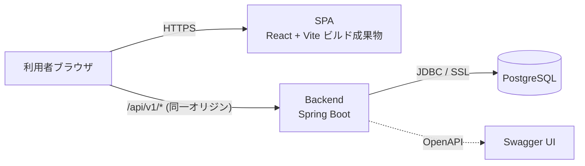
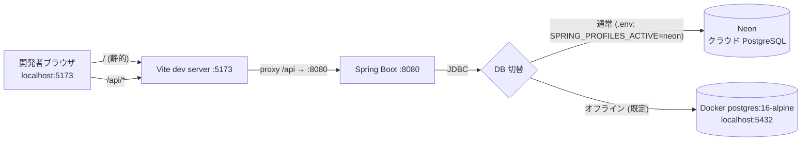
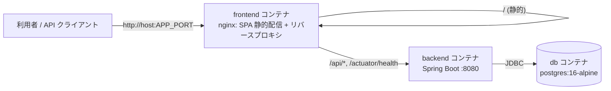
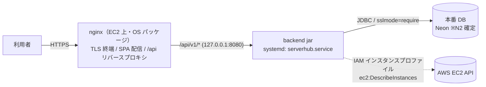

# 01. システム構成・アーキテクチャ

- バージョン: 1.1（Phase 8 でコンテナ実行構成 §1.4 を追加）
- 最終更新: 2026-09-08

## 1. システム構成

### 1.1 論理構成（環境共通）



- SPA と Backend は**同一オリジン**で配信する（requirements §6.1 P1、§10.1.17）。
  ブラウザから見て `/api/v1/*` は Backend、それ以外は SPA。CORS は不要（全拒否）。
- DB 接続は環境変数で切り替え（[ADR 0003](../../adr/0003-database-neon-with-local-docker-fallback.md)）。

### 1.2 開発環境



- Vite dev server の proxy（[ADR 0002](../../adr/0002-frontend-technology-versions.md)）でブラウザからは同一オリジン。
- Backend は `make be-run`（`.env` を読み込んで `./gradlew bootRun`）。
- スキーマは Flyway が起動時に適用（Neon / ローカル共通）。オフラインデモのシードは `make db-seed`。

### 1.3 コンテナ実行（Phase 8、[ADR 0004](../../adr/0004-containerization-nginx-spa-reverse-proxy.md)）



- **nginx が唯一のエントリポイント**。`/api/v1/*` を Backend へ中継するので同一オリジンが成立（CORS 不要）。
  §1.2 の Vite proxy と同じ役割を本番相当で nginx が担う。
- `backend` / `db` はコンテナネットワーク内のみ（ホストにポート公開しない）。
- 各コンテナはマルチステージビルド・非 root 実行・ヘルスチェック付き。起動順は
  `db →(healthy)→ backend →(healthy)→ frontend`。
- 定義: `infra/docker/docker-compose.app.yml`、`backend/Dockerfile`、`frontend/Dockerfile` + `nginx.conf`。
  操作: `make app-up` / `app-seed` / `app-down` / `app-logs`。
- スキーマ・管理ユーザーは Backend 起動時に Flyway（V1/V2）。デモデータは `make app-seed`。

### 1.4 本番構成（Phase 10 確定 → [ADR 0005](../../adr/0005-deployment-ec2-single-instance.md)）



- **EC2 1 台・非 Docker**。nginx（OS パッケージ）が TLS 終端 + SPA 静的配信 + `/api` を
  `127.0.0.1:8080` の backend jar へリバースプロキシ。同一オリジンは §1.1 / ADR 0004 のまま。
- TLS は Let's Encrypt（certbot、自動更新）。ALB は使わない（1 台構成・コスト最小）。
- Backend は `application-prod.yml` で `X-Forwarded-*` を尊重（`server.forward-headers-strategy=framework`）。
- 本番 DB は **Neon 継続**（N2 確定）。AWS 認証は IAM インスタンスプロファイル（静的キー非保存）。
- リリースは GitHub Actions（`release.yml`）→ `infra/aws/deploy.sh`。手順は [infra/aws/README.md §7](../../../infra/aws/README.md)。
- MVP は単一インスタンス前提（requirements §10.3 / S6）。冗長化・オートスケールは将来。
- コンテナ版（§1.3 / [ADR 0004](../../adr/0004-containerization-nginx-spa-reverse-proxy.md)）はローカルフルスタック確認・将来の基盤移行用に維持。

## 2. アプリケーションアーキテクチャ

### 2.1 Backend レイヤ

```
HTTP Request
  │
  ▼
[Filter] TraceId 付与(MDC) → Spring Security(認証/CSRF)
  │
  ▼
Controller  … HTTP 受付 / Request DTO / Bean Validation / Response 組み立て
  │  (Command/Query オブジェクト, ドメイン引数)
  ▼
Service     … 業務ロジック / @Transactional 境界 / 業務ルール / 複数 DAO 調整
  │  (Entity / 検索条件オブジェクト)
  ▼
DAO (Doma)  … SQL 実行のみ。@Dao インターフェース + 外部 SQL ファイル
  │
  ▼
PostgreSQL

例外は全レイヤから GlobalExceptionHandler(@RestControllerAdvice) へ → 統一エラーレスポンス
```

- 責務は `CLAUDE.md` §3 のとおり。Controller に業務ロジックを置かない。DAO は SQL のみ。
- 横断的関心事（詳細は各 PR）:
  - 認証・認可・CSRF: Spring Security（04-security）
  - trace: リクエストごとに `traceId` を MDC へ（05-cross-cutting）
  - 例外→レスポンス: `GlobalExceptionHandler`（05-cross-cutting）
  - トランザクション: Service の `@Transactional`（05-cross-cutting）
  - API ドキュメント: springdoc（コードファースト、02-api）

### 2.2 Backend パッケージ構成（`com.serverhub`）

**機能別（package by feature）** を基本とする（`CLAUDE.md` §4「機能別にサブパッケージを切る」）。

```
com.serverhub
├── ServerHubApplication
├── config/          … SecurityConfig, OpenApiConfig, WebConfig など横断設定
├── common/          … 横断部品
│   ├── error/       … GlobalExceptionHandler, ApiError, 業務例外クラス群
│   ├── web/         … TraceIdFilter, 共通レスポンス（エンベロープ）
│   └── page/        … ページング/ソートの共通型（PageRequest, PageResponse, Sort ホワイトリスト）
├── auth/            … ログイン/ログアウトに関わる設定・ハンドラ、CurrentUser 取得
├── user/            … users テーブル（認証用）。UserDao, User, UserDetailsService 実装
├── server/          … ServerController / ServerService / ServerDao / dto / Server
│   └── sql/         … Doma の SQL ファイル（resources 側に対応ディレクトリ）
├── tag/             … TagController / TagService / TagDao（サジェスト含む）
├── maintenance/     … MaintenanceController / Service / Dao / dto
└── dashboard/       … DashboardController / Service / Dao（集計クエリ）
```

- 各機能パッケージ内に Controller / Service / Dao / dto を置く。機能を跨ぐ共有型のみ `common` へ。
- 認可（ロール）を将来追加する場合の差し込み点: `config/SecurityConfig`（`authorizeHttpRequests` /
  メソッドセキュリティ）と各 `Service`（業務ルールとしての権限チェック）。MVP では設けない
  （requirements §10.1.5）。

### 2.3 Frontend レイヤ（横スライス = レイヤ別ディレクトリ）

Phase 6 実装時にオーナー判断で**機能フォルダ（feature 縦スライス）から、レイヤ別（横スライス）**へ移行
（[06-ui §10](06-ui.md)）。Backend の Controller/Service/DAO と対応させ、把握しやすくする。

```
main.tsx（Providers: QueryClient / Theme / Router）
  │
pages/        画面（SC-01〜08）。components + hooks を組み立てる       … Controller（画面）
  │
components/   UI 部品                                                … （表示）
  ├─ common/       DataTable / Pagination / Modal / ConfirmDialog / StatusChip / TagInput / ServerPicker …
  ├─ layout/       AppLayout / AppHeader / AppSidebar
  ├─ feedback/     FeedbackProvider
  └─ auth/ servers/ maintenance/   … ドメイン固有コンポーネント
  │
hooks/        useXxxQuery / useXxxMutation（TanStack Query ラップ）  … Service（オーケストレーション）
  │  auth.ts / servers.ts / maintenance.ts / tags.ts
api/          HTTP。`interface XxxApi` + `class XxxApiImpl` + `export const xxxApi`  … DAO
  │  client（Axios 唯一のインスタンス）/ errors / queryKeys / auth / servers / maintenance / tags
types/        API DTO / ドメイン enum（api.ts / domain.ts / auth.ts / server.ts / maintenance.ts）
validation/   フォーム検証（server.ts / maintenance.ts）
url/          URL クエリ ⇔ 型付きパラメータの変換
utils/  constants/  app/（合成ルート）
```

- 依存の向き: `pages → components/hooks → api → client`。逆流させない。
- **Axios を各コンポーネントから直接呼ばない**（ESLint で禁止）。`api/*` の `xxxApi` シングルトン経由。
- 実装クラスは `Impl` 末尾（`CLAUDE.md` §4）。api 層のみ（hook・純粋関数・コンポーネントはクラスでないため対象外）。
- 詳細（queryKey 設計・invalidation・ルーティング・認証ガード・共通部品）は 06-ui。

### 2.4 フロント ↔ バック通信

- ベース URL: `/api/v1`（Q2、02-api で確定）。`apiClient` は `baseURL: '/api/v1'`, `withCredentials: true`。
- 認証: セッション Cookie（HttpOnly）。CSRF: `XSRF-TOKEN` Cookie → `X-XSRF-TOKEN` ヘッダ
  （Axios 標準機能、requirements §10.1.4）。
- キャッシュ・再取得は TanStack Query（06-ui）。

## 3. 技術スタック（確定分の再掲）

詳細・根拠は ADR。ここでは構成把握のための要約。

| 層 | 技術 | ADR |
|---|---|---|
| Backend | Java 17 / Spring Boot 4.1.1 / Spring Security 7 / Doma 3 / Flyway / springdoc 3.1 | [0001](../../adr/0001-backend-technology-versions.md) |
| DB | Neon（主）/ Docker `postgres:16-alpine`（オフライン・CI）。Testcontainers 2.x（テスト） | [0003](../../adr/0003-database-neon-with-local-docker-fallback.md) |
| Frontend | React 19 / TS 6.0 / Vite 8 / MUI 9 / React Router 7 / Axios / TanStack Query 5 | [0002](../../adr/0002-frontend-technology-versions.md) |
| Build/CI | Gradle 8.14.5 + Wrapper / npm（Node 24）/ GitHub Actions | 0001 / 0002 |

## 4. 運用・将来拡張方針（概要）

### 4.1 環境と設定管理

| 環境 | DB | 設定 |
|---|---|---|
| ローカル（既定） | Docker `postgres:16-alpine` | `application.yml` 既定値（`.env.example` と一致） |
| ローカル（Neon） | Neon | `.env` に `SPRING_PROFILES_ACTIVE=neon` + `SPRING_DATASOURCE_*` → `application-neon.yml` |
| CI | Testcontainers | プロファイルなし（`./gradlew check`） |
| 本番（Phase 9） | Neon or RDS（N2） | 環境変数 / AWS Secrets Manager。`application-prod.yml`（HTTPS 前提・ログレベル等） |

- シークレットはコード・`application.yml`・Git に置かない（requirements §10.1.16）。
- プロファイルで環境差を吸収（`local` / `neon` / `prod`）。共通は `application.yml`。

### 4.2 可観測性・ヘルスチェック（概要。詳細は 05-cross-cutting）

- 構造化ログ + `traceId`。`/actuator/health`（liveness / readiness プローブ）。
- メトリクス（Micrometer 等）は将来。

### 4.3 将来拡張の「拡張ポイント」

| 拡張候補（requirements §5.3） | 設計上の余地（MVP では実装しない） |
|---|---|
| 権限管理（ロール） | `SecurityConfig` の認可ルール差し込み点、Service の権限チェック点、`users` に対する `user_roles` を追加できる正規化（03-data-model で意識） |
| 操作ログ / 監査 | 更新系を Service に集約、`created_at` / `updated_at`（将来 `created_by` / `updated_by`）。`traceId` で追跡可能 |
| SSL 期限 / 障害履歴 / 定期メンテナンス | `servers` に 1:N でぶら下がる履歴系テーブルを追加できる構造 |
| CSV 入出力 | 一覧取得ロジック（Service + 検索条件オブジェクト）を再利用できる形にする |
| 認証情報管理 | ServerHub には保存せず、Secret Manager の参照（識別子）のみ持つ方向（requirements §10.1.9） |

### 4.4 デプロイ / CI・CD（概要）

- CI: GitHub Actions `ci.yml`（`./gradlew check` + FE 全チェック）。既存。
- **コンテナ化: Phase 8 完了**（[ADR 0004](../../adr/0004-containerization-nginx-spa-reverse-proxy.md)、§1.3）。
  `backend/Dockerfile`・`frontend/Dockerfile`（+ nginx）・`infra/docker/docker-compose.app.yml`。
- **本番デプロイ: Phase 10 確定**（[ADR 0005](../../adr/0005-deployment-ec2-single-instance.md)、§1.4）。
  EC2 1 台・非 Docker。リリースは Actions `release.yml`（タグ `v*` で jar + フロント dist を Release へ）、
  EC2 上で `infra/aws/deploy.sh` が取得・差し替え・ヘルスチェック・自動ロールバック。
- Neon ブランチを PR ごとに CI で使う構成は将来（open-issues N1）。

## 5. この文書で追加した設計判断

| ID | 判断 | 根拠 |
|---|---|---|
| D-ARCH-01 | Backend は機能別パッケージ（package by feature）。各機能に Controller/Service/Dao/dto を同居 | `CLAUDE.md` §4、変更の局所性・将来のモジュール分割余地 |
| D-ARCH-02 | プロファイルは `local`（既定）/ `neon` / `prod` の 3 系統。共通は `application.yml` | ADR 0003、環境差の吸収 |
| D-ARCH-03 | 本番 SPA 配信方法・コンテナ基盤・本番 DB は Phase 8/9 で確定（MVP は単一インスタンス前提） | requirements §10.3 / S6 / N2 |
