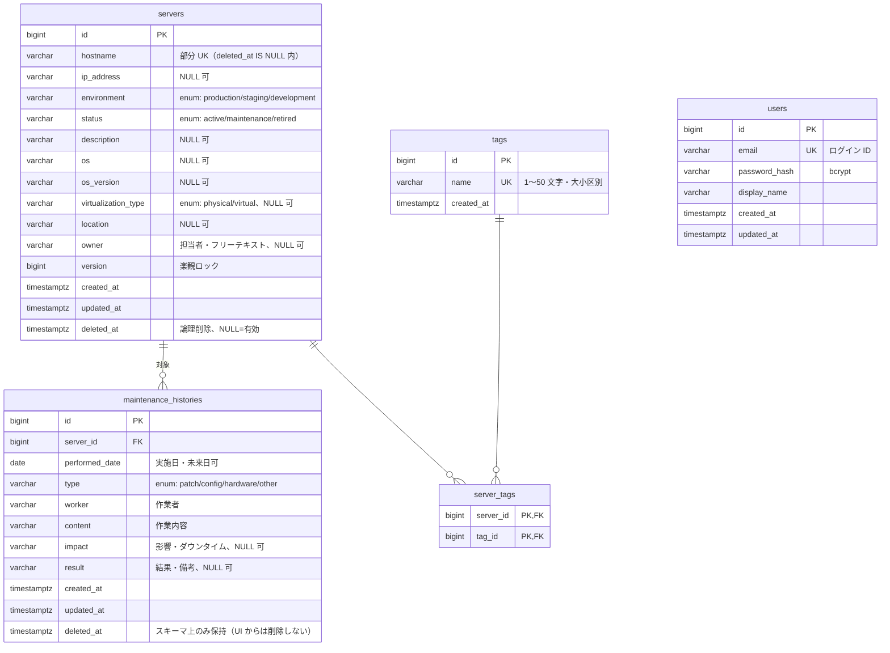

# 03. データモデル（論理設計）

- バージョン: 1.0（ドラフト・レビュー待ち）
- 最終更新: 2026-09-04
- 関連: requirements [§12](../../requirements/requirements.md)（概念データ）/ [§11 業務ルール](../../requirements/requirements.md) / [00-overview](00-overview.md) / [02-api](02-api.md)

本書は **論理データモデル**（エンティティ・属性・関連・キー・制約の方針）を定義する。
requirements §12 の概念モデルを設計レベルに具体化したもの。

**Phase 4（DB 設計）で確定するもの（本書では方針のみ）**: 物理カラム型の最終形・長さ・
`CHECK` 制約式・Index の種類とカバレッジ・Flyway マイグレーションファイル・
DB ユーザーと権限（S1）。

---

## 1. 論理 ER

`users` は業務エンティティと関連を持たないため関連線は描かない。

- 担当者（`owner`）はフリーテキストで `users` と FK にしない（requirements §12.3 / B3）。
  将来 `created_by` / `updated_by` を追加する余地のみ残す。

---

## 2. テーブル一覧

| テーブル | 役割 | PK | 削除方式 | 楽観ロック | 由来 |
|---|---|---|---|---|---|
| `users` | ログインアカウント | 代理キー `id` | 画面から削除しない（シード/スクリプト管理） | なし | requirements §12.1 / B1 |
| `servers` | 管理対象サーバー 1 台 | 代理キー `id` | **論理削除**（`deleted_at`） | あり（`version`） | B3 / Q7 |
| `tags` | 分類ラベル（全サーバー共有） | 代理キー `id` | 物理削除しない（未参照でも保持、F2） | なし | B5 / Q5 / F2 |
| `server_tags` | サーバー ⇔ タグ 多対多 | **複合キー** `(server_id, tag_id)` | **物理削除** | なし | requirements §12.1 / `CLAUDE.md` §3 |
| `maintenance_histories` | 特定サーバーへの保守作業 1 件 | 代理キー `id` | スキーマ上 `deleted_at` を持つが **UI からは削除しない**（登録・参照のみ、B4 / BR-06） | なし（追記のみ） | B4 |

### 2.1 属性の詳細（論理）

物理的な長さ・型・`CHECK` 式は Phase 4。ここでは B3 / B4（[open-issues.md](../../requirements/open-issues.md)）の
論理仕様を再掲する。

**`servers`**（必須: `hostname` / `environment` / `status` — BR-03）

| 属性 | 論理型 | 必須 | 備考 |
|---|---|---|---|
| `id` | bigint 代理キー | ✅ | API・URL で公開（`/api/v1/servers/{id}`） |
| `hostname` | 文字列（〜255） | ✅ | `deleted_at IS NULL` の範囲で一意（BR-02）。ホスト名として妥当な文字種（requirements §10.1.6） |
| `ip_address` | 文字列（〜45） | — | IPv4 / IPv6 形式。MVP は 1 つ（B3） |
| `environment` | enum 文字列 | ✅ | `production` / `staging` / `development`（B2 / BR-04） |
| `status` | enum 文字列 | ✅ | `active` / `maintenance` / `retired`。既定 `active`（B2） |
| `description` | 文字列（〜1000） | — | 用途・説明。フリーテキスト |
| `os` / `os_version` | 文字列（〜100） | — | |
| `virtualization_type` | enum 文字列 | — | `physical` / `virtual`（B3 / BR-04） |
| `location` | 文字列（〜255） | — | データセンター名・リージョン等 |
| `owner` | 文字列（〜255） | — | 担当者。フリーテキスト（`users` と FK にしない、B3） |
| `version` | bigint | ✅ | 楽観ロック。登録時 `0`、更新ごとに +1（Q7 / BR-08） |
| `created_at` / `updated_at` | timestamptz | ✅ | システムが設定（BR-10）。利用者は変更不可 |
| `deleted_at` | timestamptz | — | `NULL` = 有効。値あり = 論理削除済み（BR-01） |

**`maintenance_histories`**（必須: `server_id` / `performed_date` / `type` / `worker` / `content` — BR-03）

| 属性 | 論理型 | 必須 | 備考 |
|---|---|---|---|
| `id` | bigint 代理キー | ✅ | |
| `server_id` | bigint FK → `servers.id` | ✅ | 登録時、対象サーバーは `deleted_at IS NULL` であること（BR-06）。登録後にサーバーが論理削除されても履歴は残る（BR-09） |
| `performed_date` | date | ✅ | 日付のみ（時刻なし、B4）。**未来日も許容**（F5 / BR-10） |
| `type` | enum 文字列 | ✅ | `patch` / `config` / `hardware` / `other`（B4 / BR-04） |
| `worker` | 文字列（〜255） | ✅ | 作業者。フリーテキスト |
| `content` | 文字列（〜2000） | ✅ | 作業内容 |
| `impact` | 文字列（〜1000） | — | 影響・ダウンタイム |
| `result` | 文字列（〜1000） | — | 結果・備考 |
| `created_at` / `updated_at` | timestamptz | ✅ | システムが設定 |
| `deleted_at` | timestamptz | — | スキーマ上のみ。将来の「取り消し」用（B4） |

**`tags`**

| 属性 | 論理型 | 必須 | 備考 |
|---|---|---|---|
| `id` | bigint 代理キー | ✅ | |
| `name` | 文字列（1〜50） | ✅ | 一意。**大文字小文字を区別**（`web` ≠ `Web`、BR-07 / Q8）。前後空白除去済みの値のみ格納 |
| `created_at` | timestamptz | ✅ | |

**`server_tags`**

| 属性 | 論理型 | 必須 | 備考 |
|---|---|---|---|
| `server_id` | bigint FK → `servers.id` | ✅ | 複合 PK の一部 |
| `tag_id` | bigint FK → `tags.id` | ✅ | 複合 PK の一部 |

- 複合 PK `(server_id, tag_id)` が「同一サーバーに同名タグを重複付与しない」（BR-07）を保証する。
- 中間テーブルに代理キー `id` は設けない。監査項目も持たない（付け外しの履歴は MVP 対象外）。

**`users`**

| 属性 | 論理型 | 必須 | 備考 |
|---|---|---|---|
| `id` | bigint 代理キー | ✅ | |
| `email` | 文字列 | ✅ | 一意。ログイン ID |
| `password_hash` | 文字列 | ✅ | bcrypt（BR-13 / §10.1.2）。平文・可逆暗号は保存しない |
| `display_name` | 文字列 | ✅ | ヘッダーのユーザー表示用 |
| `created_at` / `updated_at` | timestamptz | ✅ | |

- **秘密情報のカラムを設けない**（パスワード以外の認証情報・SSH 鍵・API キー等、BR-11 / §10.1.9）。

---

## 3. 関連と参照整合性

| 関連 | 多重度 | FK | 削除時の振る舞い |
|---|---|---|---|
| `servers` — `maintenance_histories` | 1 : 0..N | `maintenance_histories.server_id` → `servers.id` | サーバーは論理削除のみ（物理削除しない）→ FK 違反は起きない。`ON DELETE` は `RESTRICT`（既定）で十分。物理削除運用を将来入れる場合は Phase 4 で再検討 |
| `servers` — `tags` | 0..N : 0..N（`server_tags` 経由） | `server_tags.server_id` → `servers.id` / `server_tags.tag_id` → `tags.id` | サーバー論理削除時、Service が対象の `server_tags` 行を**物理削除**する（`CLAUDE.md` §3 / FR-SRV-06）。`tags` 本体は残す（F2） |
| `users` — 業務エンティティ | 関連なし（MVP） | — | 「担当者」はフリーテキスト。将来 `created_by` 等で関連を追加できる |

- FK はすべて Phase 4 で `FOREIGN KEY` 制約として張る（アプリ側のチェックと二重防御）。
- 参照先の存在チェックは Service でも行い、不存在は `404`（IDOR 対策、§10.1.5 / 02-api §2.4）。

---

## 4. DB 設計方針

### 4.1 命名

- テーブル・カラムは `snake_case`、テーブル名は複数形（`CLAUDE.md` §4）。
- 主キーは `id`、外部キーは `<参照先単数>_id`（`server_id` / `tag_id`）。
- 監査列は `created_at` / `updated_at` / `deleted_at` に統一。

### 4.2 主キー

- **全テーブル代理キー `bigint` の自動採番**（PostgreSQL `GENERATED ALWAYS AS IDENTITY`）。
  例外は中間テーブル `server_tags`（複合自然キー）。
- UUID は採用しない：分散生成の要件がなく、内部ツールで連番の秘匿性も不要（存在推測は
  認証 + 存在チェック + `404` で対処、§10.1.5）。`bigint` の方が Index・結合が軽い。
- 代理キーは API・URL でそのまま公開する（02-api で確定済み）。

### 4.3 データ型の方針（詳細は Phase 4）

| 論理型 | 物理（方針） | 理由 |
|---|---|---|
| 代理キー | `bigint identity` | 4.2 |
| 文字列（短〜中） | `varchar(n)`（n は B3/B4 の長さ） | DB 側でも長さを強制（多層防御、§10.1.6） |
| 長文（説明・作業内容） | `varchar(n)` or `text` + アプリ側 `@Size` | Phase 4 で判断 |
| enum（環境・ステータス・種別・仮想化） | `varchar` + `CHECK (col IN (...))` | B2 / BR-04。DB enum 型は値追加時の運用が重いため採らない。Java 側は `enum` |
| 日付（実施日） | `date` | 時刻を持たない（B4） |
| 日時（監査列） | `timestamptz` | UTC で保持し、API は ISO 8601 + オフセットで返す（02-api D-API-05）。将来のマルチリージョン・サマータイム耐性 |
| 論理削除フラグ | `timestamptz`（`deleted_at`） | 「いつ削除したか」も残る。`boolean` にしない |

### 4.4 一意性・論理削除

- `servers.hostname` は **部分ユニークインデックス** `UNIQUE (hostname) WHERE deleted_at IS NULL`
  （BR-02）。論理削除済みと同名のホスト名は新規登録できる。
- `tags.name`、`users.email` は通常の `UNIQUE`。`tags.name` は大小区別のため `citext` を使わず
  `varchar` + バイナリ比較。
- 一覧・検索・ダッシュボード集計のクエリはすべて `WHERE deleted_at IS NULL` を付与する（BR-01）。
  ただし **メンテナンス履歴一覧はサーバーの `deleted_at` を条件にしない**（削除済みサーバーの履歴も表示、BR-09）。

### 4.5 楽観ロック

- `servers.version`（`bigint NOT NULL DEFAULT 0`）+ Doma `@Version`。
- 更新時、リクエストの `version` が現在値と一致する場合のみ `UPDATE ... WHERE id = ? AND version = ?`。
  影響行 0 → 競合として `409`（BR-08 / FR-SRV-05）。
- `maintenance_histories`（追記のみ）・`tags`・`server_tags` には設けない。

### 4.6 Index 方針（種類・詳細は Phase 4）

requirements §10.2.2 の方針を踏襲。想定クエリから最低限:

| テーブル | 対象 | 用途 |
|---|---|---|
| `servers` | 部分 UK `(hostname) WHERE deleted_at IS NULL` | 重複チェック・一意性 |
| `servers` | `(updated_at)` | 既定ソート（B6） |
| `servers` | `(environment)` / `(status)` | 絞り込み・ダッシュボード集計 |
| `server_tags` | `(server_id)` / `(tag_id)` | タグ絞り込み（AND 判定）・詳細表示 |
| `maintenance_histories` | `(server_id, performed_date DESC)` | サーバー別履歴・一覧の既定ソート |
| `maintenance_histories` | `(performed_date DESC)` | 全体履歴一覧・ダッシュボード「最近のメンテナンス」 |
| `tags` | UK `(name)` | サジェスト（前方一致 `LIKE 'prefix%'` は B-tree が効く、F3）|
| `users` | UK `(email)` | ログイン |

- `keyword` の部分一致（`LIKE '%kw%'`）は B-tree が効かないが、データ規模（〜1,000、B7）で許容。
  増加時に `pg_trgm` / 全文検索を検討（Phase 4 以降、requirements §10.2.2）。

### 4.7 マイグレーション

- **Flyway**。ファイルは `backend/src/main/resources/db/migration/V<n>__<説明>.sql`（`CLAUDE.md` §10）。
- `V1__init.sql` で全テーブル + 制約 + Index + enum の `CHECK` を作成（ベースライン）。
- ログインユーザーのシードは Flyway or 初期化スクリプト（§12.5 / B1）。
  オフラインデモ用ダミー（サーバー・タグ・履歴）は `infra/docker/initdb/01_seed.sql`（Flyway 適用後 `make db-seed`、[ADR 0003](../../adr/0003-database-neon-with-local-docker-fallback.md)）。
  → 本書のカラム名で `01_seed.sql` が既に前提化している（同ファイル冒頭の注記）。差異が出たら Phase 4 で同期。
- Neon / ローカル Docker で同一のマイグレーションを適用（起動時自動、[01-architecture](01-architecture.md) §1.2）。
- DB ユーザーの分離（マイグレーション実行者とアプリ実行者、最小権限）は **Phase 4〜5**（S1 確定）。

### 4.8 Doma エンティティへのマッピング（方針。詳細は Phase 3 / 5）

- `servers` → `Server`、`maintenance_histories` → `MaintenanceHistory`、`tags` → `Tag`、
  `server_tags` は関連として扱い専用エンティティは最小限、`users` → `User`。
- テーブル/カラム名の対応は Doma の命名規約（`snake_case` ⇄ `camelCase` 自動変換）を使う。
- `version` は `@Version`。`created_at` / `updated_at` は Doma のエンティティリスナー or Service で設定（BR-10）。
- enum カラムは Java `enum` + Doma の `@Domain` or `EnumType`。値（`production` 等）を永続化。

---

## 5. 将来拡張の余地（MVP では作らない）

requirements §5.3 / §10.1 の拡張ポイントを、スキーマ変更が最小で済む形にしておく。

| 拡張 | 追加が想定される要素 | 現設計での配慮 |
|---|---|---|
| 権限管理（ロール） | `roles` / `user_roles`（`users` に多対多） | `users` を代理キーにしてあり `user_roles` 追加は非破壊。認可の差し込み点は [01-architecture](01-architecture.md) §4.3 |
| 操作ログ / 監査 | `audit_logs`（`trace_id` / `user_id` / 操作種別 / 対象 type,id / 変更前後）、`servers` / `maintenance_histories` に `created_by` / `updated_by` | 監査列の命名を統一済み。更新系は Service に集約（requirements §10.1.11） |
| SSL 期限 / 障害履歴 / 定期メンテナンス | `servers` に 1:N でぶら下がる履歴系テーブル | `servers.id` 代理キーに FK を張るだけで追加可能 |
| 複数 IP | `server_ip_addresses`（`servers` 1:N） | 現状 `ip_address` 単一（B3）。分離時もサーバー本体の変更は不要 |
| 認証情報の参照管理 | Secret Manager の識別子（ARN/パス）のみを持つ列 or テーブル | 秘密情報の値は保存しない方針を維持（BR-11 / §10.1.9） |

---

## 6. この文書で追加・確定した事項

| ID | 事項 | 根拠 |
|---|---|---|
| D-DATA-01 | 全テーブル代理キー `bigint identity`（中間 `server_tags` を除く）。UUID 不採用。ID は API で公開 | 内部ツール・分散生成なし・Index 効率。02-api と整合 |
| D-DATA-02 | 監査日時は `timestamptz`（UTC 保持）。実施日は `date` | タイムゾーン耐性、02-api D-API-05 |
| D-DATA-03 | `server_tags` は複合自然キー `(server_id, tag_id)`、代理キーなし、監査列なし | BR-07 を制約で保証、付け外し履歴は MVP 外 |
| D-DATA-04 | enum は `varchar` + `CHECK`（DB enum 型不採用）、Java は `enum` | B2 / BR-04、値追加の運用性 |
| D-DATA-05 | `servers.hostname` は部分ユニークインデックス（`WHERE deleted_at IS NULL`） | BR-02 |
| D-DATA-06 | `V1__init.sql` を単一ベースラインとし、既存 `infra/docker/initdb/01_seed.sql` のカラム名に整合 | Flyway 運用、ADR 0003 |

- 物理型・長さ・`CHECK` 式・Index 種別・マイグレーション実装・DB ユーザー権限（S1）は **Phase 4**。
- Doma エンティティ / DAO / SQL の具体は **Phase 3（詳細設計）/ Phase 5（実装）**。
