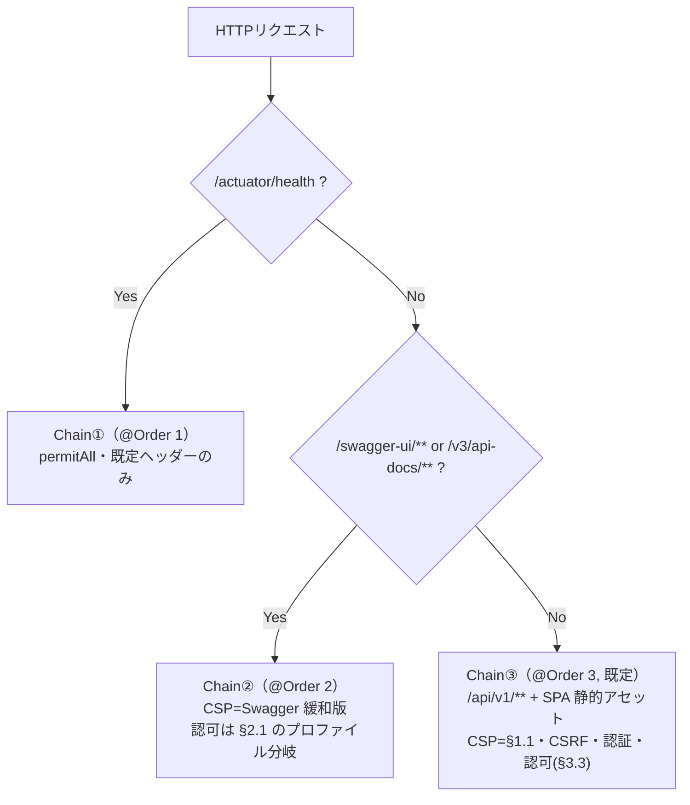

# 04. 認証・認可・セキュリティ設計

- バージョン: 1.0（ドラフト・レビュー待ち）
- 最終更新: 2026-09-04
- 関連: requirements [§10.1](../../requirements/requirements.md)（セキュリティ要件、確定済み）/ [02-api](02-api.md) / [01-architecture](01-architecture.md)

requirements §10.1 で「何を満たすか」は確定済み。本書は **`SecurityConfig` をどう組むか**を
設計レベルで定義し、残る **S5（CSP 厳格度）** と **Swagger UI の公開範囲**を確定する。
Bean の実クラス名・結合テストのシナリオは Phase 3 / 5。

---

## 1. S5 の確定：Content-Security-Policy

requirements §10.1.1 の実装コスト評価（「MVP は緩い CSP に留め、厳格化は Phase 2/3 以降」）を受け、
以下で確定する。

### 1.1 決定（D-SEC-01）

**MVP は enforce（違反をブロック）で、緩めのポリシーから開始する。** Report-Only や nonce 方式は採らない。

```
Content-Security-Policy:
  default-src 'self';
  script-src 'self';
  style-src 'self' 'unsafe-inline';
  img-src 'self' data:;
  font-src 'self';
  connect-src 'self';
  object-src 'none';
  base-uri 'self';
  form-action 'self';
  frame-ancestors 'none'
```

| ディレクティブ | 値 | 理由 |
|---|---|---|
| `default-src` | `'self'` | 明示しないリソース種別は同一オリジンのみに限定 |
| `script-src` | `'self'`（**inline 不可**） | 注入スクリプト（XSS）による実行を防ぐ本丸。Vite ビルドは外部 `<script src>` のみで inline を出さないため MVP から強制できる |
| `style-src` | `'self' 'unsafe-inline'` | MUI/emotion が実行時に `<style>` を注入するため許容（nonce 化は Phase 6 以降で検討）。style の inline 実行は script ほど実害が大きくない |
| `img-src` | `'self' data:` | アイコン等の data URI を許容 |
| `connect-src` | `'self'` | `fetch`/`XHR`（Axios）は同一オリジンのみ |
| `object-src` | `'none'` | `<object>`/`<embed>` 経由の攻撃面を塞ぐ |
| `frame-ancestors` | `'none'` | クリックジャッキング対策（`X-Frame-Options: DENY` と重複防御） |
| `base-uri` / `form-action` | `'self'` | `<base>` 差し替え・フォーム送信先の乗っ取りを防ぐ |

**採用理由・代替案**（[00-overview](00-overview.md) §3 の未決事項）:

- **Report-Only を不採用**: 導入コストは低いが「防御効果が当面ゼロ」になる。MVP は
  ポートフォリオとして防御が機能している状態を示したい（RK-08）。上表の緩めのポリシーは
  Vite/MUI の実際の出力（inline script なし・inline style あり）を検証した上での enforce であり、
  壊れるリスクは低い。
- **nonce 方式を不採用**: 防御は最も強いが、`index.html` への nonce 注入フィルタと emotion の
  nonce 設定が必要で、Vite の `index.html` 差し込み・Swagger UI のバンドルとの整合コストが
  requirements §10.1.1 の見積り「高」に見合わない。**Phase 6（Frontend 実装後の仕上げ）で
  再評価**する拡張点として残す。
- `script-src` は最初から `'self'`（inline 不可）にできる：Vite の本番ビルドは inline script を
  出力しないため、"緩める"のは `style-src` のみで足りる。

### 1.2 Swagger UI の隔離

Swagger UI 自体は inline script を使う場合があるため、**上記アプリ CSP をそのまま適用しない**
（requirements §10.1.13「Swagger を別パスに隔離しつつ」）。`/swagger-ui/**` `/v3/api-docs/**` にのみ、
`script-src 'self' 'unsafe-inline'` を許容した専用ポリシーを適用する（§6.2 のフィルタチェーン分離で実現）。
影響範囲は Swagger のパスに限定され、業務 SPA の CSP は緩めない。

---

## 2. Swagger UI の公開範囲

requirements §8.4 は「未認証で許可」としているが、本書で環境別に確定する。

### 2.1 決定（D-SEC-02）

| 環境 | `/swagger-ui/**` `/v3/api-docs/**` |
|---|---|
| ローカル（`local` / `neon` プロファイル） | **未認証で許可**（開発中の確認を妨げない） |
| 本番（`prod` プロファイル） | **認証必須**（ログイン済みセッションが必要） |

- 設定は `application-prod.yml` に `serverhub.security.swagger-permit-all: false`（既定 `true`）を持たせ、
  `SecurityConfig` で参照する。プロファイルごとに `SecurityFilterChain` の構築を分岐させない
  （条件分岐はプロパティ 1 つに閉じ込める）。
- 本番で Swagger を認証必須にしても requirements §14「内部向けの仕様確認」目的は損なわない
  （認証済み利用者は引き続き閲覧可能）。外部公開はしない方針（§14）は変わらず維持。
- requirements §8.4 の記述と齟齬が出るため、同 PR で requirements 側にも本決定への参照を追記する。

---

## 3. 認証（Spring Security 構成）

### 3.1 全体方針

- **フォームログイン + サーバーサイドセッション**（requirements §10.1.2）。JWT なし。
- パスワードは `PasswordEncoderFactories.createDelegatingPasswordEncoder()`（既定 bcrypt）。
- `UserDetailsService` は `auth` パッケージで実装し、`user` パッケージの `UserDao` を利用
  （[01-architecture](01-architecture.md) §2.2 のパッケージ構成）。

### 3.2 ログイン・ログアウトの応答（02-api との整合）

`POST /api/v1/auth/login` / `POST /api/v1/auth/logout` は Spring Security のデフォルトの
リダイレクト応答ではなく、[02-api §3.1](02-api.md) の JSON 契約を返す：

| フック | 実装方針 | 応答 |
|---|---|---|
| ログイン成功 | `AuthenticationSuccessHandler` | `200` + ログインユーザー（`id`/`email`/`displayName`）。リダイレクトしない |
| ログイン失敗 | `AuthenticationFailureHandler` | `401` + 統一エラー（資格情報不正の共通メッセージ、requirements §10.1.2） |
| 未認証で保護 API にアクセス | `AuthenticationEntryPoint` | `401` + 統一エラー。ログインページへの HTML リダイレクトはしない（API のため） |
| ログアウト成功 | `LogoutSuccessHandler` | `204`（セッション無効化 + Cookie 削除） |

- いずれも例外時は `GlobalExceptionHandler` と同じ `{ code, message, traceId }` 形式で統一する
  （[05-cross-cutting](05-cross-cutting.md) で `traceId` 採番と合わせて確定）。
- ログイン成功時のセッション ID 再生成（`changeSessionId`、固定化対策）は Spring Security 既定動作を利用。

### 3.3 認可（authorizeHttpRequests）

MVP は「認証済みか否か」のみ（requirements §10.1.5）。

| パスパターン | 制御 |
|---|---|
| `POST /api/v1/auth/login` | `permitAll`（ログイン前提のため） |
| `/api/v1/**`（上記以外） | `authenticated()`（`auth/logout`・`auth/me` を含む全業務 API） |
| `/actuator/health` | `permitAll`（requirements §10.3 ヘルスチェック） |
| `/swagger-ui/**`, `/v3/api-docs/**` | `§2.1` の決定に従いプロファイルで分岐 |
| SPA 静的アセット（上記以外すべて） | `permitAll`（ルートガードは Frontend、実アクセス制御は業務 API 側、requirements §10.1.5） |

- `@PreAuthorize` 等のメソッドセキュリティは **MVP では付けない**（過剰実装回避、requirements §10.1.5）。
- 将来のロール導入時の差し込み点は [01-architecture §4.3](01-architecture.md) のとおり
  `SecurityConfig` の認可ルールと各 `Service` の 2 箇所。

---

## 4. セッション管理

| 項目 | 設定 | 根拠 |
|---|---|---|
| アイドルタイムアウト | `server.servlet.session.timeout=30m` | S4 確定 |
| Cookie `HttpOnly` | 有効（既定） | requirements §10.1.3 |
| Cookie `Secure` | `local`/`neon`: 無効、`prod`: 有効（`server.servlet.session.cookie.secure`） | 環境差異（requirements §10.1.14） |
| Cookie `SameSite` | `Lax`（`server.servlet.session.cookie.same-site=lax`） | 同一オリジン配信のため十分 |
| セッション固定化対策 | `changeSessionId`（既定） | ログイン成功時に再採番 |
| 同時セッション制限 | なし（MVP） | requirements §10.1.3 |
| セッションストア | インメモリ（単一インスタンス前提） | S6、[01-architecture §4.1](01-architecture.md) |

- `refetchInterval` を持つクエリを作らない方針（S8）は [06-ui](06-ui.md) で Frontend 側のルールとして明記する。

---

## 5. CSRF

requirements §10.1.4 の方式をそのまま採用し、実装上の落とし穴（§10.1.1 の留意点）への対応を明記する。

### 5.1 構成

- `CookieCsrfTokenRepository.withHttpOnlyFalse()`：`XSRF-TOKEN` Cookie（JS から読める）でトークンを配布。
- Axios（`apiClient`）: `xsrfCookieName: 'XSRF-TOKEN'` / `xsrfHeaderName: 'X-XSRF-TOKEN'`
  （[01-architecture §2.4](01-architecture.md)）。
- 対象: `POST` / `PUT` / `DELETE`（安全メソッド `GET`/`HEAD`/`OPTIONS` は対象外）。

### 5.2 既知の落とし穴と対応（requirements §10.1.1）

- Spring Security 6 系のトークンリクエストハンドラは **遅延読み込み**（BREACH 攻撃対策）が既定で、
  何かがトークンを実際に参照するまで `XSRF-TOKEN` Cookie が発行されないケースがある。
  → SPA が最初に投げる `GET /api/v1/auth/me`（[02-api §2.2](02-api.md)）で確実に Cookie が
  発行されることを、**実装時に結合テストで確認する**（`GlobalExceptionHandler` 等と合わせて
  Phase 5 のテスト観点）。発行されない場合は明示的なハンドラ設定に切り替える。
- ログイン `POST` 自体も CSRF 対象のため、ログイン画面表示時に上記 `GET` を先行させる
  （Frontend 側のルール、[06-ui](06-ui.md)）。

---

## 6. HTTP セキュリティヘッダー・フィルタチェーン構成

### 6.1 ヘッダー設定値

| ヘッダー | 値 | 適用範囲 |
|---|---|---|
| `X-Content-Type-Options` | `nosniff` | 全体（Spring Security 既定） |
| `X-Frame-Options` | `DENY` | 全体 |
| `Referrer-Policy` | `strict-origin-when-cross-origin` | 全体 |
| `Strict-Transport-Security` | 本番のみ、HTTPS リクエスト時に自動付与（Spring Security 既定挙動） | 本番 |
| `Content-Security-Policy` | §1.1（アプリ）/ §1.2（Swagger 専用の緩和） | パス別 |
| `Permissions-Policy` | 未使用機能を無効化（`camera=(), microphone=(), geolocation=()` 等） | 全体 |

### 6.2 `SecurityFilterChain` を 3 系統に分離

CSP・認証要否がパスごとに異なるため、`@Order` で 3 つの `SecurityFilterChain` に分ける。



- Chain①②は最小構成（該当パスのみに限定した `securityMatcher`）。Chain③が業務 API と CSRF・
  セッション・認証の主要ロジックを持つ。
- フィルタの実装詳細（クラス構成・Bean 定義）は Phase 5。

---

## 7. CORS

- 明示的な `CorsConfigurationSource` は登録しない（＝すべてのクロスオリジンリクエストを拒否、
  requirements §10.1.17）。「未設定だから許可されない」ではなく、**拒否することを設計として明記**する。
- 将来 Frontend を別オリジンに切り出す場合は、許可 Origin のホワイトリスト + `allowCredentials: true`
  を `application-*.yml` に環境別追加する（requirements §10.1.17 の将来方針どおり、MVP では実装しない）。

---

## 8. 入力検証・SQLi・XSS・秘密情報・ログ

以下は requirements §10.1.6〜§10.1.11 で確定済みであり、本書では実装配置のみ補足する（内容の重複記載はしない）。

| 項目 | 実装配置 | 参照 |
|---|---|---|
| Bean Validation（Request DTO） | Controller 層（`@Valid`） | requirements §10.1.6、[02-api §2.4](02-api.md) |
| ソート項目ホワイトリスト | `common/page` の固定マップ経由で解決（[01-architecture §2.2](01-architecture.md)） | requirements §10.1.7、[02-api §2.5](02-api.md) |
| SQL バインド・`LIKE` エスケープ | DAO 層の Doma SQL（`/*%if*/` + バインド変数） | requirements §10.1.7 |
| XSS（React 既定エスケープ、`dangerouslySetInnerHTML` 原則禁止） | Frontend 全体 | requirements §10.1.8、[06-ui](06-ui.md) |
| 秘密情報を保存する項目を作らない | `servers` / `maintenance_histories` のスキーマ（[03-data-model](03-data-model.md)） | requirements §10.1.9 / BR-11 |
| 機密情報のログ出力禁止・`traceId` 付与 | 構造化ログ + MDC フィルタ | requirements §10.1.11、[05-cross-cutting](05-cross-cutting.md) |

---

## 9. この文書で確定した事項

| ID | 事項 | 根拠 |
|---|---|---|
| D-SEC-01 | CSP は**緩め・enforce**で開始。`script-src 'self'`（inline 不可）、`style-src` のみ `'unsafe-inline'` 許容。nonce 化・Report-Only は不採用、Phase 6 で再評価 | S5、requirements §10.1.1/§10.1.13、ユーザー承認（2026-09-04） |
| D-SEC-02 | Swagger UI は開発（`local`/`neon`）は未認証可、本番（`prod`）は認証必須。`serverhub.security.swagger-permit-all` プロパティで切替 | requirements §8.4 の上書き、ユーザー承認（2026-09-04） |
| D-SEC-03 | Swagger 専用に緩和 CSP（`script-src 'self' 'unsafe-inline'`）を適用し、アプリ本体の CSP は緩めない | requirements §10.1.13「別パスに隔離」 |
| D-SEC-04 | `SecurityFilterChain` を `@Order` で 3 系統（health / swagger / app）に分離 | パスごとに CSP・認可が異なるため |
| D-SEC-05 | ログイン・ログアウトは Spring Security 既定のリダイレクトを使わず、02-api の JSON 契約をカスタムハンドラで返す | [02-api §3.1](02-api.md) との整合 |
| D-SEC-06 | CORS は明示的な許可設定を持たない（設計として拒否を明記） | requirements §10.1.17 |

- requirements §8.4（Swagger 未認証）は本書 D-SEC-02 により本番で上書きされる。同 PR で requirements 側に注記を追加する。
- Bean の実クラス構成・結合テストのシナリオは Phase 3（詳細設計）/ Phase 5（Backend 実装）。
