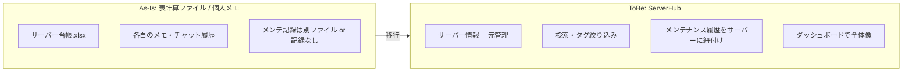
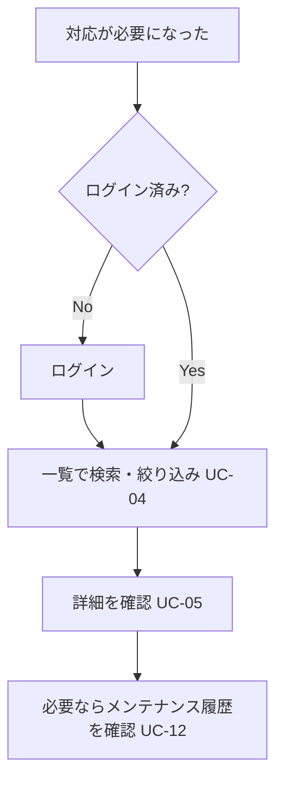
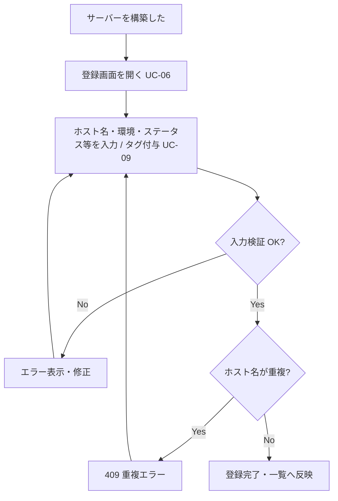
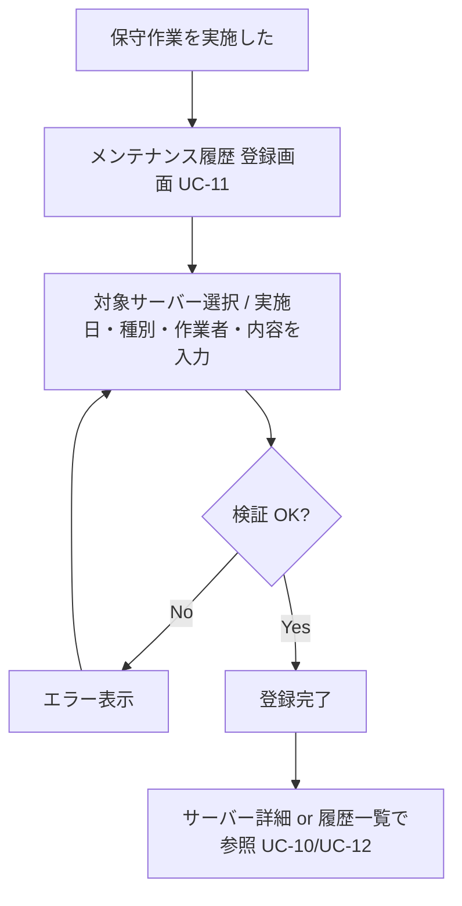
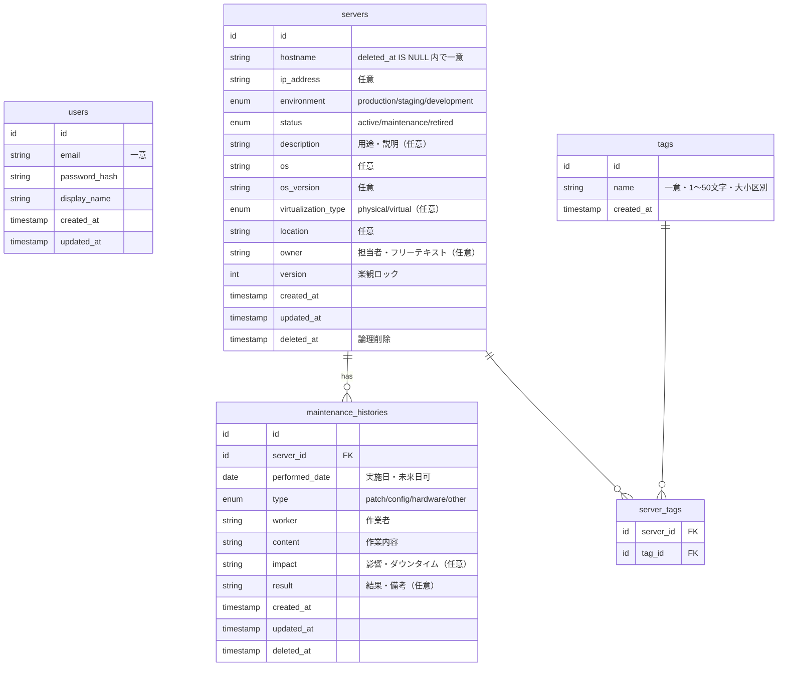
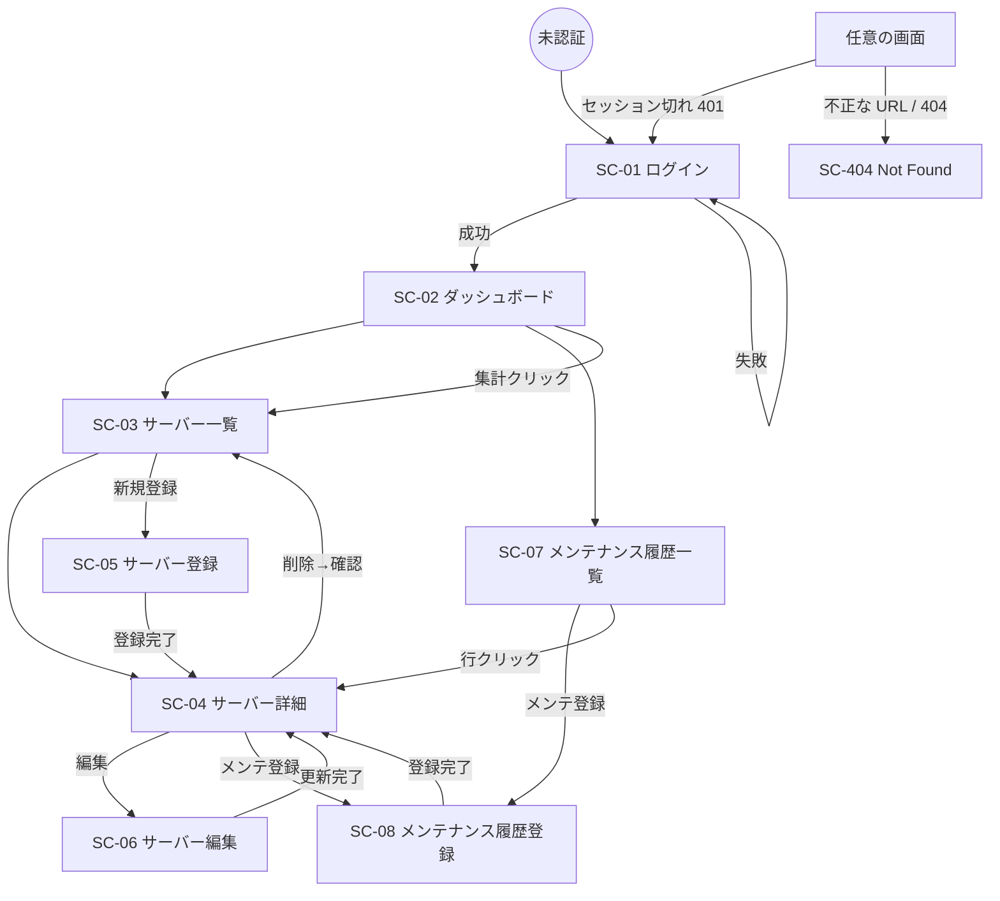

# ServerHub 要件定義書

- バージョン: 0.9（ドラフト・全章記述済み）
- 最終更新: 2026-09-04
- ステータス: **全 18 章のドラフトを記述済み。オーナーレビュー待ち。** 承認後 1.0。
  一部に【要承認】/ open-issues（F6・F7 ほか）と、後続フェーズで確定する項目（Phase 2〜4）を残す。

> 【要承認】マークの箇所はオーナー未確認の叩き台。合意後にマークを外す。
> 未決事項は [open-issues.md](open-issues.md) で管理する。

---

## 1. はじめに

### 1.1 本書の位置づけ

本書は ServerHub（インフラチーム向けサーバー管理・運用支援ツール）の要件を定義する。
基本設計（Phase 2）以降の入力であり、スコープと「何を作るか」の合意形成を目的とする。
「どう作るか」（アーキテクチャ・技術選定）は `CLAUDE.md` および `docs/adr/` に従う。

### 1.2 対象読者

- 開発者（プロジェクトオーナー兼務）
- ポートフォリオのレビュアー（第三者）

### 1.3 用語定義

| 用語 | 定義 |
|---|---|
| サーバー | 本システムの管理対象となる物理/仮想サーバー、またはそれに準じるホスト 1 台 |
| タグ | サーバーを任意の観点で分類・絞り込むためのラベル（例: `web`, `db`, `顧客A`）。サーバーに複数付与できる |
| メンテナンス履歴 | 特定のサーバーに対して実施した保守作業の記録 1 件 |
| 環境区分 | サーバーが属する運用環境の種別。`production`（本番）/ `staging`（ステージング）/ `development`（開発）の 3 種（enum） |
| ステータス | サーバーの現在の運用状態。`active`（稼働中）/ `maintenance`（メンテナンス中）/ `retired`（廃止）の 3 種（enum） |
| 論理削除 | レコードを物理的に削除せず「削除済み」印（`deleted_at`）を付け、通常の一覧・検索から除外する方式 |
| ダッシュボード | 主要な集計値を一覧できるトップ画面 |
| インフラチーム | サーバーの構築・運用・保守を担当するチーム。本システムの唯一の利用者 |

用語は随時追加する。

---

## 2. 背景と課題

### 2.1 背景

インフラチームは複数のサーバーを運用しており、各サーバーの基本情報（ホスト名、IP、用途、
環境、担当者など）と、実施した保守作業の履歴を把握し続ける必要がある。

### 2.2 現状の課題

叩き台（一般的なインフラ運用でよく見られる課題。オーナーの実体験に合わせて修正する）。

| # | 課題 | 影響 |
|---|---|---|
| C1 | サーバー情報が表計算ファイルや個人メモに分散し、最新版がどれか分からない | 誤操作・確認漏れ、属人化 |
| C2 | サーバーの検索・絞り込みが手作業（ファイル内検索）で非効率 | 対応の初動が遅れる |
| C3 | メンテナンス履歴が残らない、または別の場所にあり、サーバー情報と紐づかない | 過去対応の参照・監査ができない |
| C4 | 全体像（総数・環境別内訳など）を即座に把握できない | 棚卸し・報告に手間がかかる |
| C5 | 情報更新のルールが曖昧で、鮮度が保てない | データが信頼されず使われなくなる |

### 2.3 課題を放置した場合のリスク

- 障害対応・変更作業時の確認コスト増、ヒューマンエラー
- 担当者不在時に情報が取り出せない（属人化）
- 監査・報告の都度、情報を収集する工数が発生

---

## 3. 目的とゴール

### 3.1 目的

インフラチームが管理するサーバー情報とメンテナンス情報を一元管理し、
検索・確認・更新・履歴確認といった日常の運用業務を効率化する。

### 3.2 スコープ内で達成する状態（MVP のゴール）

| # | ゴール | 確認方法 |
|---|---|---|
| G1 | サーバー情報が 1 箇所に集約され、認証済みメンバーが同じ最新情報を参照できる | サーバー一覧・詳細画面 |
| G2 | 名前・タグ・環境・ステータス等でサーバーを数秒で絞り込める | 検索・絞り込み機能 |
| G3 | 各サーバーのメンテナンス履歴が、そのサーバーに紐づいた形で残り、後から参照できる | サーバー詳細のメンテナンス履歴、履歴一覧 |
| G4 | サーバーの全体像（総数・環境別・ステータス別・タグ別）を 1 画面で把握できる | ダッシュボード |
| G5 | 情報の登録・更新・削除が画面から安全に行える（バリデーション・確認・論理削除） | 各 CRUD 画面 |

### 3.3 非ゴール（このプロジェクトで目指さないこと）

- 監視・アラート・構成管理（Zabbix / Ansible 等の代替ではない）
- インシデント管理・チケット管理
- 複数チーム・複数テナントでの利用、細かい権限制御（→ 5.3 将来拡張）

### 3.4 ポートフォリオとしての目標

実務水準の設計（レイヤ責務・API/DB 設計・エラー/ログ設計・テスト・非機能）を
一通り示すこと。機能の多さよりも「作り込みの質」を評価対象とする。

---

## 4. 利用者

### 4.1 想定ユーザー

| 区分 | 説明 | 規模（想定） |
|---|---|---|
| インフラチームメンバー | サーバーの構築・運用・保守担当。全員が同じ操作権限を持つ | 数名〜十数名程度 |

MVP では役割（ロール）による区別を行わない。全ユーザーが全機能を利用できる。

### 4.2 利用シーン

| シーン | 使う機能 |
|---|---|
| 障害・変更対応の初動でサーバーの素性を確認する | 検索 → 詳細 |
| 新しいサーバーを構築したので登録する | サーバー登録、タグ付与 |
| 保守作業を実施したので記録する | メンテナンス履歴登録 |
| サーバーを廃止した | サーバー削除（論理削除） |
| 月次の棚卸し・報告 | ダッシュボード、一覧のフィルタ |

### 4.3 権限（MVP）

- 認証済みユーザー: 全機能（参照・登録・更新・削除）を利用可能
- 未認証ユーザー: ログイン画面以外は一切利用不可
- 管理者/一般の区別: なし（将来拡張として設計上の余地のみ残す。→ 5.3）

### 4.4 ユーザーアカウントの発行

- ユーザー登録（サインアップ）画面は設けない
- アカウントは Flyway のシード SQL または初期化スクリプトで作成する
- パスワード変更・リセットの画面は MVP 対象外（→ open-issues）

---

## 5. スコープ

### 5.1 対象範囲（MVP で実装する）

| 分類 | 機能 |
|---|---|
| 認証 | ログイン / ログアウト / 未認証アクセスの遮断 |
| サーバー | 一覧（ページング）/ 検索・絞り込み / 詳細 / 登録 / 編集 / 削除（論理削除） |
| タグ | サーバーへのタグ付与・解除 / タグによる絞り込み |
| メンテナンス履歴 | 一覧 / 登録 / サーバー詳細からの履歴参照 |
| ダッシュボード | サーバー総数 / 環境別数 / ステータス別数 / タグ別数 / 最近のメンテナンス |
| 共通 UI | モーダル / 非同期更新 / ローディング表示 / エラー表示 / 通知 / グラフ |

### 5.2 対象外（MVP で実装しない）

SSL 期限管理、定期メンテナンス、障害履歴、CSV インポート/エクスポート、操作ログ、
権限管理（ロール）、ユーザー登録画面、パスワードリセット画面、通知のメール/チャット連携、
サーバーへの実接続・死活監視、API の外部公開（社外システム連携）。

### 5.3 将来拡張（設計上の余地のみ残す）

| 拡張候補 | 残す余地 |
|---|---|
| 権限管理（ロール） | ユーザーにロールを持たせられるテーブル設計、認可を差し込める層（Spring Security のフィルタチェーン） |
| 操作ログ | 主要な更新系処理を通す Service 層、`traceId`/監査項目（`created_by` 等）の付与余地 |
| SSL 期限・障害履歴・定期メンテナンス | サーバーに 1:N でぶら下がる履歴系テーブルを追加できる構造 |
| CSV 入出力 | 一覧取得ロジックを再利用できる Service、検索条件オブジェクトの分離 |

---

## 6. 前提条件・制約事項

### 6.1 前提条件

| # | 前提 |
|---|---|
| P1 | 利用は社内ネットワーク内を想定。SPA はバックエンドと同一ドメインで配信する |
| P2 | 利用者は全員インフラチームの一員で、悪意ある操作は想定しない（ただし認証・入力検証は必須） |
| P3 | 対応ブラウザはモダンブラウザの最新安定版（Chrome / Edge / Firefox / Safari の最新） |
| P4 | 画面・ドキュメントの言語は日本語 |
| P5 | 同時利用者数は小規模（数名〜十数名）。大量同時アクセスは想定しない |

### 6.2 技術制約

`CLAUDE.md` §2 および `docs/adr/` で確定済み。要約:

| 層 | 制約 |
|---|---|
| Backend | Java 17 / Spring Boot 4.1 / Spring Security（セッション + Cookie 認証、CSRF 有効）/ Doma / Flyway |
| DB | PostgreSQL 16。`servers` / `maintenance_histories` は論理削除、`server_tags` は物理削除 |
| Frontend | React 19 / TypeScript / Vite / MUI / React Router / Axios / TanStack Query。API は `api/` 層経由 |
| API | REST。仕様は OpenAPI（springdoc、コードファースト）で管理 |
| インフラ | 開発 DB は **Neon（クラウド PostgreSQL）を主**とし、オフラインデモ用にローカル Docker Compose へ環境変数で切り替え可能（[ADR 0003](../adr/0003-database-neon-with-local-docker-fallback.md)）。デプロイ先は AWS（Phase 9 で詳細化。本番 DB は Neon 継続か RDS かを Phase 9 で判断） |

### 6.3 運用・体制制約

| # | 制約 |
|---|---|
| R1 | 開発体制は 1 名 + Claude Code。フェーズを小さく区切り、レビュー可能な単位で進める |
| R2 | `main` への直接コミット禁止。`feature/*` → PR → セルフレビュー → マージ |
| R3 | コード変更時は関連する設計ドキュメントを同一 PR で更新する |

### 6.4 セキュリティ制約（要点）

社内ツールだが「信頼された利用者が使う社内システムであっても、入力値・認証・セッション・
秘密情報・ログ・DB・通信は安全に扱う」を方針とする。詳細と MVP での実装範囲は
**10.1 セキュリティ**で定義する。要点のみ:

- パスワードは Spring Security 標準の `PasswordEncoder`（bcrypt 系）でハッシュ化して保存
- 認証されていないリクエストは全 API で遮断（Backend 側で必ず判定）
- 状態変更 API（POST/PUT/PATCH/DELETE）に CSRF 対策を適用
- 入力値検証は Backend 側でも必ず実施（Frontend のみに依存しない）
- エラーレスポンスに内部情報（スタックトレース・SQL・クラス名等）を含めない
- パスワード・トークン・セッション ID・Cookie をログに出力しない
- シークレットをソースコード・`application.yml`・Git にハードコードしない（`.env` は Git 管理外）
- 認証情報（SSH 鍵・API キー・DB パスワード等）そのものは ServerHub に保存しない

---

## 7. 業務フロー

対象は §4.2 の利用シーン。**As-Is（現行）は一般的なインフラ運用の想定**であり、
オーナーの実運用に合わせた加筆・修正が必要（【要承認】）。ToBe は ServerHub 導入後。

各フローの末尾に、解消される課題（§2.2 C1〜C5）を示す。

### 7.1 全体像



### 7.2 サーバー情報の確認（障害・変更対応の初動）

| | As-Is | ToBe |
|---|---|---|
| 手順 | 1. 台帳ファイルを開く → 2. ファイル内検索でホスト名/用途を探す → 3. 複数ファイル・チャットを横断 → 4. 最新か判断がつかない | 1. ログイン → 2. 一覧画面でキーワード/タグ/環境/ステータスで絞り込み → 3. 詳細画面で確認（メンテナンス履歴も同画面から） |
| 所要 | 数分〜。情報が古い / 見つからないことがある | 数十秒。全員が同じ最新情報 |



→ 解消: **C1**（最新版の所在）、**C2**（検索の非効率）

### 7.3 サーバーの新規登録

| | As-Is | ToBe |
|---|---|---|
| 手順 | 台帳ファイルに行を追加。書式・必須項目は人によりばらつく。タグ相当の分類は自由記述 | 登録画面で入力（必須項目・形式は Backend が検証）。タグを付与。保存で即時に全員へ反映 |



→ 解消: **C1**（分散・書式ばらつき）、**C5**（更新ルールの曖昧さ）

### 7.4 サーバー情報の更新

| | As-Is | ToBe |
|---|---|---|
| 手順 | 台帳の該当行を編集。誰がいつ変えたか残らない。同時編集で上書き事故のリスク | 編集画面で変更 → 保存。`updated_at` が更新される。同時編集は**楽観ロック**で競合を検知し `409`（Q7） |

→ 解消: **C1**、**C5**

### 7.5 サーバーの廃止

| | As-Is | ToBe |
|---|---|---|
| 手順 | 台帳から行を削除 or 色を変える。削除すると履歴も消える | 一覧/詳細から削除（**論理削除**）。確認ダイアログの後、`deleted_at` を設定。一覧・検索・集計から除外され、DB 上は保持（Q6） |

→ 解消: **C3**（履歴の消失）

### 7.6 メンテナンス作業の記録

| | As-Is | ToBe |
|---|---|---|
| 手順 | 作業後に別ファイル or チャットに記録、または記録しない。対象サーバーとの紐付けが弱い | 対象サーバーを選び、メンテナンス履歴を登録（実施日・種別・作業者・内容）。サーバー詳細から時系列で参照できる。登録のみ（編集・削除なし、B4） |



→ 解消: **C3**

### 7.7 棚卸し・報告

| | As-Is | ToBe |
|---|---|---|
| 手順 | 台帳を目視で数える。環境別・タグ別の集計は手作業（フィルタ・関数） | ダッシュボードで総数 / 環境別 / ステータス別 / タグ別 / 最近のメンテナンスを一覧。一覧のフィルタで詳細も確認 |

→ 解消: **C4**（全体像の把握）

### 7.8 課題と業務フローの対応表

| 課題 | 解消するフロー | 主な機能 |
|---|---|---|
| C1 情報の分散・最新版不明 | 7.2 / 7.3 / 7.4 | サーバー CRUD・一覧 |
| C2 検索の非効率 | 7.2 | 検索・タグ絞り込み |
| C3 メンテナンス履歴が残らない/紐づかない | 7.5 / 7.6 | メンテナンス履歴（登録・参照） |
| C4 全体像を即座に把握できない | 7.7 | ダッシュボード |
| C5 更新ルールの曖昧さ | 7.3 / 7.4 | 入力検証・`updated_at`・（運用ルール §11） |

## 8. ユースケース

### 8.1 アクター

| アクター | 説明 |
|---|---|
| インフラチームメンバー（利用者） | 認証済みユーザー。全ユースケースを実行できる（MVP は権限差なし） |
| システム（ServerHub） | 認証・検証・永続化・集計を行う |
| （将来）管理者 | ロール管理導入時に追加。MVP では区別しない |

### 8.2 ユースケース一覧

| ID | ユースケース | 主な機能（§5.1） | ゴール（§3.2） |
|---|---|---|---|
| UC-01 | ログインする | 認証 | 前提 |
| UC-02 | ログアウトする | 認証 | 前提 |
| UC-03 | サーバー一覧を表示する | サーバー | G1 |
| UC-04 | サーバーを検索・絞り込みする | サーバー / タグ | G2 |
| UC-05 | サーバー詳細を表示する | サーバー | G1 |
| UC-06 | サーバーを登録する | サーバー / タグ | G1, G5 |
| UC-07 | サーバー情報を編集する | サーバー / タグ | G1, G5 |
| UC-08 | サーバーを削除する（論理削除） | サーバー | G5 |
| UC-09 | サーバーにタグを付与・解除する | タグ | G2 |
| UC-10 | メンテナンス履歴の一覧を表示する | メンテナンス履歴 | G3 |
| UC-11 | メンテナンス履歴を登録する | メンテナンス履歴 | G3 |
| UC-12 | サーバー詳細からメンテナンス履歴を参照する | メンテナンス履歴 | G3 |
| UC-13 | ダッシュボードを閲覧する | ダッシュボード | G4 |

> UC-09 のタグ付与・解除は、UI 上は UC-06 / UC-07 の画面内で行う。UC-04 のタグ絞り込みは UC-04 に含む。

### 8.3 横断的な事前条件・例外（全ユースケース共通）

- **事前条件**: UC-01 を除き、認証済みであること。未認証で業務 API を呼ぶと `401`（Frontend はログイン画面へ誘導）。
- **共通例外**:

  | 状況 | HTTP | 画面の挙動 |
  |---|---|---|
  | 未認証 / セッション切れ | 401 | ログイン画面へ遷移。再ログイン後は可能なら元の操作へ戻す |
  | 入力値が不正（必須未入力・形式・enum・文字数） | 400 | フィールド単位のエラー表示。送信をブロック |
  | 対象リソースが存在しない（不正 ID・削除済み） | 404 | 「対象が見つかりません」表示・一覧へ戻す |
  | 一意制約違反（ホスト名重複）・状態競合（同時編集） | 409 | 競合内容を提示し再入力を促す |
  | サーバー内部エラー | 500 | 汎用メッセージ + `traceId` を表示。詳細はサーバーログ |
  | 通信エラー（ネットワーク断・タイムアウト） | — | 再試行を促す通知。TanStack Query のリトライ方針に従う |

  （HTTP ステータスの使い分けは `CLAUDE.md` §4、レスポンス形式は §10.1.12）

### 8.4 主要ユースケース記述

#### UC-01 ログインする

- **アクター**: 利用者（未認証）
- **事前条件**: 有効なアカウントが存在する（Flyway シード / スクリプトで作成済み、§4.4）
- **主シナリオ**:
  1. 利用者がログイン画面でメールアドレスとパスワードを入力し送信する。
  2. システムは資格情報を検証し（パスワードはハッシュ照合、§10.1.2）、成功ならセッションを開始し、
     セッション ID を再生成する（固定化対策）。CSRF トークン Cookie を発行する。
  3. トップ（ダッシュボード）へ遷移する。
- **事後条件**: セッションが確立し、以降 30 分間（S4）操作がなければ失効する。
- **例外**:
  - E1 資格情報が不正: `401`。「メールアドレスまたはパスワードが正しくありません」（ユーザーの存在は示さない）。失敗をログに記録（§10.1.2）。
  - E2 既にログイン済みでログイン画面へアクセス: ダッシュボードへリダイレクト。

#### UC-02 ログアウトする

- **主シナリオ**: 利用者がログアウトを選択 → システムはサーバー側セッションを無効化し、セッション Cookie を削除 → ログイン画面へ遷移。
- **事後条件**: 以降の業務 API アクセスは `401`。

#### UC-03 サーバー一覧を表示する

- **主シナリオ**:
  1. 利用者が一覧画面を開く。
  2. システムは `deleted_at IS NULL` のサーバーを、既定ソート（更新日時降順、B6）・既定ページサイズ（20 件、B6）で返す。
  3. 各行にホスト名・環境・ステータス・主要タグ・更新日時等を表示。総件数・ページ番号を表示。
- **代替**: A1 ページ移動 / ページサイズ変更（10/20/50/100、B6）→ 該当ページを取得。
- **例外**: 共通例外（401）。存在しないページ番号 → 空リスト + 総件数（`400` にはしない）。

#### UC-04 サーバーを検索・絞り込みする

- **主シナリオ**:
  1. 利用者が検索条件を指定する: キーワード（ホスト名 / IP / 用途に部分一致）、環境（完全一致）、
     ステータス（完全一致）、タグ（複数、**AND** = 全タグを持つ、B5）。
  2. システムは条件を AND で結合し、`deleted_at IS NULL` かつ条件一致のサーバーを、
     指定ソート・ページングで返す（ソート項目はホワイトリスト、§10.1.7）。
  3. 結果一覧と件数を表示。条件は URL クエリに反映（再現・共有可能）。
- **業務ルール**: 条件未指定は「全件（削除除く）」。キーワードは前後空白を除去。`LIKE` はワイルドカードをエスケープ（§10.1.7）。
- **例外**:
  - E1 不正な検索条件（未知の環境値・`size > 100`・不正なソート項目）: `400`。
  - 共通例外（401）。

#### UC-05 サーバー詳細を表示する

- **主シナリオ**: 利用者が一覧から 1 件選択 → システムは当該サーバーの全属性（B3）と、
  紐づくメンテナンス履歴（実施日の新しい順、既定件数）を返す → 詳細画面に表示。
- **例外**:
  - E1 ID が不正な形式: `400`。
  - E2 対象が存在しない / 論理削除済み: `404`。
  - 共通例外（401）。

#### UC-06 サーバーを登録する

- **事前条件**: 認証済み。
- **主シナリオ**:
  1. 利用者が登録画面で属性を入力する（必須: ホスト名・環境区分・ステータス。任意: IP・用途・OS 等、B3）。タグを付与する（UC-09）。
  2. システムは入力を検証する（必須・文字数・IP/ホスト名形式・enum、§10.1.6）。
  3. ホスト名の重複（`deleted_at IS NULL` の範囲、B3）を確認する。
  4. サーバーとタグ関連（`server_tags`）を 1 トランザクションで保存する。`created_at` / `updated_at` を設定。
  5. 詳細画面 or 一覧へ遷移し、成功通知を表示。
- **事後条件**: 新しいサーバーが一覧・検索・集計に現れる。
- **例外**:
  - E1 入力不正: `400`（フィールド単位）。
  - E2 ホスト名が既存（削除されていない）と重複: `409`。「同名のホストが既に登録されています」。
  - E3 保存中の DB エラー: `500`（トランザクションはロールバック）。
  - 共通例外（401）。

#### UC-07 サーバー情報を編集する

- **主シナリオ**:
  1. 利用者が詳細/一覧から編集を開始 → 現在値がフォームに表示される。
  2. 変更して保存 → システムは検証（UC-06 と同じ）、ホスト名を変更した場合は重複確認。
  3. 楽観的ロック（`version` 一致確認、Q7）で他者による更新がないか確認し、更新して `updated_at` を更新。タグの差分を反映。
- **例外**:
  - E1 入力不正: `400`。
  - E2 ホスト名重複: `409`。
  - E3 編集中に他者が同じサーバーを更新（バージョン不一致）: `409`。「他のメンバーが更新しました。最新の内容を確認してください」。
  - E4 対象が削除済み: `404`。
  - 共通例外（401）。

#### UC-08 サーバーを削除する（論理削除）

- **主シナリオ**:
  1. 利用者が詳細/一覧で削除を選択 → 確認ダイアログを表示（誤操作防止、§3.2 G5）。
  2. 確認 → システムは `deleted_at` に現在時刻を設定（物理削除しない）。`server_tags` の扱いは物理削除（`CLAUDE.md` §3）。
  3. 一覧・検索・ダッシュボード集計から除外される（Q6）。メンテナンス履歴は DB 上残る。
- **事後条件**: 復元 UI は MVP になし（Q6）。
- **例外**:
  - E1 対象が存在しない / 既に削除済み: `404`。
  - 共通例外（401）。

#### UC-09 サーバーにタグを付与・解除する

- **主シナリオ**: UC-06 / UC-07 の画面で、既存タグをサジェストしつつ自由入力で追加、または既存タグを外す（Q5）。保存時に `server_tags` の差分（追加/削除）を反映（中間テーブルは物理削除、`CLAUDE.md` §3）。
- **業務ルール**: 同一サーバーに同名タグを重複付与しない。タグ名は前後空白を除去、大文字小文字は区別する（Q8。詳細は §11）。
- **例外**: 入力不正（空・長すぎ）: `400`。共通例外（401）。

#### UC-10 メンテナンス履歴の一覧を表示する

- **主シナリオ**: 利用者が履歴一覧画面を開く → システムは全サーバーのメンテナンス履歴を実施日の新しい順・ページングで返す（サーバー名・実施日・種別・作業者を表示）。対象サーバーで絞り込み可能。
- **例外**: 共通例外（401）。不正なページ → UC-03 と同様。

#### UC-11 メンテナンス履歴を登録する

- **事前条件**: 認証済み。対象サーバーが存在し、削除されていない。
- **主シナリオ**:
  1. 利用者が登録画面で対象サーバーを選び、実施日（日付）・種別（enum、B4）・作業者・作業内容を入力する（任意: 影響・結果）。
  2. システムは検証（必須・文字数・実施日の形式・種別 enum、§10.1.6）し、対象サーバーの存在（未削除）を確認する。
  3. 保存し、`created_at` を設定。
  4. サーバー詳細 or 履歴一覧へ遷移し成功通知。
- **事後条件**: 当該サーバーの詳細（UC-12）と履歴一覧（UC-10）に現れる。**編集・削除はできない**（B4）。
- **例外**:
  - E1 入力不正: `400`。
  - E2 対象サーバーが存在しない / 削除済み: `404`。
  - E3 DB エラー: `500`。
  - 共通例外（401）。

#### UC-12 サーバー詳細からメンテナンス履歴を参照する

- **主シナリオ**: UC-05 の詳細画面内に、当該サーバーのメンテナンス履歴を実施日の新しい順で表示する。件数が多い場合は「もっと見る」/ 履歴一覧（UC-10）へ誘導。
- **例外**: 共通例外（401）。対象サーバー不存在: `404`。

#### UC-13 ダッシュボードを閲覧する

- **主シナリオ**:
  1. 利用者がダッシュボード（トップ）を開く。
  2. システムは以下を集計して返す（すべて `deleted_at IS NULL` 対象）:
     - サーバー総数
     - 環境区分別のサーバー数
     - ステータス別のサーバー数
     - タグ別のサーバー数（上位のみ表示等、表示仕様は §13 / Q4）
     - 最近のメンテナンス（直近 10 件、Q4）
  3. 数値・グラフ（Recharts 候補）で表示。各集計から対応する絞り込み一覧へ遷移できる。
- **業務ルール**: 集計は論理削除を除外。N+1 を避け、集計クエリで取得（§10.2 性能）。
- **例外**: 共通例外（401）。データ 0 件でも画面は成立する（0 表示）。

### 8.5 トレーサビリティ（ゴール ↔ ユースケース）

| ゴール | 対応ユースケース |
|---|---|
| G1 情報の集約・最新参照 | UC-03, UC-05, UC-06, UC-07 |
| G2 数秒での絞り込み | UC-04, UC-09 |
| G3 メンテナンス履歴の紐付き参照 | UC-10, UC-11, UC-12 |
| G4 全体像の把握 | UC-13 |
| G5 安全な登録・更新・削除 | UC-06, UC-07, UC-08 |
| （前提）認証 | UC-01, UC-02 |

## 9. 機能要件

§8 のユースケースを実装レベルに落としたもの。入力項目は B3 / B4
（[open-issues.md](open-issues.md)、2026-09-04 確定）、検索/ソート/ページングは B5 / B6、
エラーは §8.3 共通例外表と §10.1.12 に従う。

- API パス・バージョニング（`/api/v1`）とレスポンスエンベロープ形式は **Phase 2 で確定**（Q2）。
  本章では相対的な振る舞いを定義する。
- 権限は全 FR 共通で「**認証済みユーザーのみ**（MVP は権限差なし）」。以降、各 FR では省略する。

### 9.1 機能一覧

| FR ID | 機能 | 対応 UC | 分類（§5.1） | ゴール |
|---|---|---|---|---|
| FR-AUTH-01 | ログイン | UC-01 | 認証 | 前提 |
| FR-AUTH-02 | ログアウト | UC-02 | 認証 | 前提 |
| FR-AUTH-03 | 未認証アクセスの遮断 | 横断 | 認証 | 前提 |
| FR-SRV-01 | サーバー一覧・ページング | UC-03 | サーバー | G1 |
| FR-SRV-02 | サーバー検索・絞り込み・ソート | UC-04 | サーバー / タグ | G2 |
| FR-SRV-03 | サーバー詳細表示 | UC-05 | サーバー | G1 |
| FR-SRV-04 | サーバー登録 | UC-06 | サーバー / タグ | G1, G5 |
| FR-SRV-05 | サーバー編集 | UC-07 | サーバー / タグ | G1, G5 |
| FR-SRV-06 | サーバー削除（論理削除） | UC-08 | サーバー | G5 |
| FR-TAG-01 | サーバーへのタグ付与・解除 | UC-09 | タグ | G2 |
| FR-TAG-02 | 既存タグのサジェスト | UC-06, UC-07, UC-04 | タグ | G2 |
| FR-MNT-01 | メンテナンス履歴一覧 | UC-10 | メンテナンス履歴 | G3 |
| FR-MNT-02 | メンテナンス履歴登録 | UC-11 | メンテナンス履歴 | G3 |
| FR-MNT-03 | サーバー詳細からの履歴参照 | UC-12 | メンテナンス履歴 | G3 |
| FR-DASH-01 | ダッシュボード集計・表示 | UC-13 | ダッシュボード | G4 |
| FR-COM-01 | 統一エラー表示 | 横断 | 共通 UI | G5 |
| FR-COM-02 | ローディング表示 | 横断 | 共通 UI | — |
| FR-COM-03 | 通知（トースト） | 横断 | 共通 UI | — |
| FR-COM-04 | 確認ダイアログ | UC-08 ほか | 共通 UI | G5 |
| FR-COM-05 | グラフ表示 | UC-13 | 共通 UI | G4 |
| FR-COM-06 | モーダル・非同期更新 | 横断 | 共通 UI | — |

### 9.2 機能別詳細

各 FR は「概要 / 入力 / 処理・業務ルール / 出力 / エラー」で記述する。

---

#### FR-AUTH-01 ログイン

- **概要**: メールアドレスとパスワードで認証し、セッションを開始する（UC-01）。
- **入力**: メールアドレス（必須・形式）、パスワード（必須）。
- **処理・業務ルール**:
  - パスワードはハッシュ照合（§10.1.2）。成功時はセッション ID を再生成（固定化対策）、CSRF トークン Cookie を発行。
  - 成功・失敗をログに記録（`traceId` / ユーザー識別子 / 結果 / クライアント IP）。パスワードは記録しない。
  - アイドルタイムアウト 30 分（S4）。
- **出力**: 成功時はセッション確立（Cookie）。Frontend はダッシュボードへ遷移。
- **エラー**: 資格情報不正 → `401`、ユーザーの存在を示さない共通メッセージ。`400`（未入力・形式）。
- **備考**: ブルートフォース時のロック/レート制限は MVP 対象外（S3）。

#### FR-AUTH-02 ログアウト

- **概要**: セッションを破棄する（UC-02）。
- **入力**: なし（CSRF トークンは必要）。
- **処理**: サーバー側セッションを無効化し、セッション Cookie を削除。
- **出力**: Frontend はログイン画面へ遷移。以降の業務 API は `401`。

#### FR-AUTH-03 未認証アクセスの遮断

- **概要**: 認証を要する全 API・画面で、未認証アクセスを Backend で遮断する（横断）。
- **処理・業務ルール**:
  - 業務 API は `SecurityFilterChain` で `authenticated()`。未認証は `401`。
  - 未認証で許可するのは: ログイン、静的アセット、`/actuator/health`、API ドキュメント（Swagger）。
  - Frontend のルートガードは UX 目的であり、アクセス制御の実体は Backend（§10.1.5）。
- **エラー**: 未認証の API → `401`。Frontend は 401 を検知してログイン画面へ誘導し、可能なら元の遷移先を保持。

#### FR-SRV-01 サーバー一覧・ページング

- **概要**: 削除されていないサーバーを一覧表示する（UC-03）。
- **入力（クエリ）**: `page`（0 始まり、既定 0）、`size`（既定 20、許可値 10/20/50/100、上限 100）、
  `sort`（項目はホワイトリスト、既定「更新日時」）、`order`（`asc`/`desc`、既定 `desc`）。
- **処理・業務ルール**:
  - 対象は `deleted_at IS NULL`。
  - ソート可能項目（ホワイトリスト、§10.1.7、F1 確定）: ホスト名 / 環境区分 / ステータス / 更新日時 / 登録日時。
  - `size` が許可値外 → 既定値に丸める（`400` にしない）。存在しない `page` → 空配列 + 総件数。
- **出力**: サーバーの一覧（1 件あたり: ホスト名、環境区分、ステータス、主要タグ、更新日時、（一覧用の識別子））、
  総件数、現在ページ、ページサイズ。1 行に付き 1 回のクエリで必要データを取得（N+1 回避、§10.2）。
- **エラー**: `401`。不正な `sort` 項目 → `400`。

#### FR-SRV-02 サーバー検索・絞り込み・ソート

- **概要**: 複数条件でサーバーを絞り込む（UC-04）。FR-SRV-01 の拡張。
- **入力（クエリ）**: FR-SRV-01 のページング/ソートに加え、
  - `keyword`: 文字列。**ホスト名 / IP / 用途** に部分一致（OR）。前後空白除去。`LIKE` のワイルドカードはエスケープ（§10.1.7）。
  - `environment`: enum（`production`/`staging`/`development`）。完全一致。
  - `status`: enum（`active`/`maintenance`/`retired`）。完全一致。
  - `tags`: タグ名の配列。指定した**全タグ**を持つサーバーのみ（AND、B5）。
- **処理・業務ルール**:
  - 各条件は AND で結合。未指定の条件は無視。条件なし = 全件（削除除く）。
  - タグ AND は「指定タグ数 = 一致タグ数」で判定（集計 or サブクエリ）。N+1 を避ける。
  - 検索条件は URL クエリに保持し、再現・共有可能にする（Frontend）。
- **出力**: FR-SRV-01 と同形式 + 適用中の検索条件。
- **エラー**: `401`。未知の enum 値・`size > 100`・不正な `sort` → `400`。

#### FR-SRV-03 サーバー詳細表示

- **概要**: 1 台のサーバーの全項目と、紐づくメンテナンス履歴を表示する（UC-05 / UC-12）。
- **入力**: サーバー識別子（パス）。
- **処理・業務ルール**:
  - `deleted_at IS NULL` の 1 件を取得。付随するタグ一覧、直近のメンテナンス履歴（実施日降順、既定件数。全件は FR-MNT-03）。
- **出力**: B3 の全属性 + タグ + メンテナンス履歴（一部）+ 登録/更新日時 + `version`（楽観ロック用、Q7）。
- **エラー**: 識別子の形式不正 → `400`。不存在 / 削除済み → `404`。`401`。

#### FR-SRV-04 サーバー登録

- **概要**: 新しいサーバーを登録する（UC-06）。
- **入力**（B3）:

  | 項目 | 必須 | 制約 |
  |---|---|---|
  | ホスト名 | ✅ | 1〜255 文字、ホスト名として妥当な文字種、`deleted_at IS NULL` 内で一意 |
  | 環境区分 | ✅ | enum |
  | ステータス | ✅ | enum、既定 `active` |
  | IP アドレス | 任意 | IPv4/IPv6 形式、〜45 文字 |
  | 用途・説明 | 任意 | 〜1000 文字 |
  | OS / OS バージョン | 任意 | 〜100 文字 |
  | 物理/仮想の別 | 任意 | enum（`physical`/`virtual`） |
  | ロケーション | 任意 | 〜255 文字 |
  | 担当者 | 任意 | 〜255 文字（フリーテキスト） |
  | タグ | 任意 | 複数（FR-TAG-01） |

- **処理・業務ルール**:
  - Backend でバリデーション（§10.1.6）。
  - ホスト名の重複（`deleted_at IS NULL` の範囲）を確認。
  - サーバーとタグ関連（`server_tags`）を **1 トランザクション**で保存。`created_at` / `updated_at` / `version=0`。
- **出力**: 登録されたサーバー（FR-SRV-03 と同形式）。Frontend は成功通知（FR-COM-03）+ 詳細/一覧へ遷移。
- **エラー**: 入力不正 → `400`（フィールド単位）。ホスト名重複 → `409`。保存時 DB エラー → `500`（ロールバック）。`401`。

#### FR-SRV-05 サーバー編集

- **概要**: 既存サーバーの属性・タグを更新する（UC-07）。
- **入力**: FR-SRV-04 と同項目 + 対象識別子 + `version`（楽観ロック、Q7）。
- **処理・業務ルール**:
  - バリデーションは FR-SRV-04 と同じ。ホスト名を変更した場合のみ重複確認。
  - **楽観ロック**: 送られた `version` が現在値と一致する場合のみ更新。不一致は `409`。
  - タグは差分（追加/削除）を `server_tags` に反映（中間テーブルは物理削除、`CLAUDE.md` §3）。
  - 更新後 `updated_at` を更新、`version` をインクリメント。
- **出力**: 更新後のサーバー。Frontend は成功通知 + 詳細へ。
- **エラー**: 入力不正 → `400`。ホスト名重複 → `409`。`version` 不一致（他者が更新）→ `409`（最新確認を促す）。対象が削除済み → `404`。`401`。

#### FR-SRV-06 サーバー削除（論理削除）

- **概要**: サーバーを論理削除する（UC-08）。
- **入力**: 対象識別子。（Frontend は事前に確認ダイアログ FR-COM-04）
- **処理・業務ルール**:
  - `deleted_at` に現在時刻を設定（物理削除しない）。`server_tags` は物理削除。
  - 削除済みは FR-SRV-01/02、FR-DASH-01 の対象外。メンテナンス履歴は DB 上保持。
  - 復元 UI は MVP になし（Q6）。
- **出力**: 成功（内容なし or 削除済みフラグ）。Frontend は成功通知 + 一覧へ。
- **エラー**: 不存在 / 既に削除済み → `404`。`401`。

#### FR-TAG-01 サーバーへのタグ付与・解除

- **概要**: サーバー登録/編集時にタグを付け外しする（UC-09）。単独の API ではなく FR-SRV-04/05 の一部。
- **入力**: タグ名の配列（サーバーの登録/編集リクエストに含む）。
- **処理・業務ルール**（Q8）:
  - タグ名は前後空白を除去。空文字は無視。**1〜50 文字**（F2 確定）。
  - 大文字小文字は区別する（`web` と `Web` は別タグ）。全角半角の変換はしない。
  - 同一サーバーに同名タグを重複付与しない（リクエスト内の重複は 1 件に集約）。
  - 既存タグは再利用（マスタ的な `tags` テーブルを引く / なければ作成）。どのサーバーからも参照されなくなったタグの掃除は **MVP 対象外**（F2 確定。残ってもサジェストに出るだけ）。
- **出力**: 付与後のタグ一覧（サーバーのレスポンスに含む）。
- **エラー**: タグ名が長すぎる/不正 → `400`。`401`。

#### FR-TAG-02 既存タグのサジェスト

- **概要**: タグ入力時に既存タグ名を候補表示する（UC-06/07 の入力補助、UC-04 の絞り込み補助）。
- **入力**: 入力中の文字列（**前方一致**、F3 確定）。
- **処理・業務ルール**: 既存タグ名で、入力文字列から始まるものを返す。件数上限（例: 20）。
- **出力**: タグ名の配列。
- **エラー**: `401`。

#### FR-MNT-01 メンテナンス履歴一覧

- **概要**: 全サーバーのメンテナンス履歴を一覧表示する（UC-10）。
- **入力（クエリ）**: ページング（FR-SRV-01 と同様、既定ソートは実施日降順）、`serverId`（任意、対象サーバーで絞り込み）。
- **処理・業務ルール**: 実施日の新しい順。**対象サーバーが論理削除されていても履歴は表示する**（行にサーバーが削除済みである旨を示す。F4 確定）。ただしダッシュボードの集計対象からは除外。
- **出力**: 履歴一覧（1 件: サーバー識別子・サーバー名、実施日、種別、作業者）、総件数、ページ情報。
- **エラー**: `401`。不正なページング → FR-SRV-01 と同様。

#### FR-MNT-02 メンテナンス履歴登録

- **概要**: 特定サーバーのメンテナンス履歴を登録する（UC-11）。
- **入力**（B4）:

  | 項目 | 必須 | 制約 |
  |---|---|---|
  | 対象サーバー | ✅ | 存在し、`deleted_at IS NULL` であること |
  | 実施日 | ✅ | 日付（`YYYY-MM-DD`）。**未来日も許容**（予定を先に登録するケース。F5 確定） |
  | 種別 | ✅ | enum（`patch`/`config`/`hardware`/`other`） |
  | 作業者 | ✅ | 1〜255 文字（フリーテキスト） |
  | 作業内容 | ✅ | 1〜2000 文字 |
  | 影響・ダウンタイム | 任意 | 〜1000 文字 |
  | 結果・備考 | 任意 | 〜1000 文字 |

- **処理・業務ルール**:
  - Backend バリデーション（§10.1.6）。対象サーバーの存在（未削除）を確認。
  - 保存し `created_at` を設定。**登録のみ**（編集・削除の API は作らない、B4）。
- **出力**: 登録された履歴。Frontend は成功通知 + サーバー詳細 / 履歴一覧へ。
- **エラー**: 入力不正 → `400`。対象サーバー不存在 / 削除済み → `404`。DB エラー → `500`。`401`。

#### FR-MNT-03 サーバー詳細からの履歴参照

- **概要**: サーバー詳細画面内で、そのサーバーの履歴を時系列で参照する（UC-12）。
- **入力**: サーバー識別子、ページング（任意）。
- **処理・業務ルール**: 当該サーバーの履歴を実施日降順。詳細画面では直近数件、「もっと見る」で全件 or 履歴一覧（FR-MNT-01）へ。
- **出力**: 当該サーバーの履歴（1 件: 実施日、種別、作業者、作業内容の抜粋 / 詳細）。
- **エラー**: サーバー不存在 → `404`。`401`。

#### FR-DASH-01 ダッシュボード集計・表示

- **概要**: 主要な集計値を 1 画面で表示する（UC-13）。
- **入力**: なし。
- **処理・業務ルール**（すべて `deleted_at IS NULL` 対象）:
  - サーバー総数
  - 環境区分別のサーバー数（3 区分すべて。0 件も 0 と表示）
  - ステータス別のサーバー数（3 区分すべて）
  - タグ別のサーバー数（**上位 10 件 + 「その他」**、表示仕様は §13。F5 確定）
  - 最近のメンテナンス（実施日降順で直近 10 件、Q4）
  - 集計は**集計クエリ**で取得し N+1 を避ける（§10.2）。
- **出力**: 上記の集計結果（数値 + グラフ用データ）。各集計から対応する絞り込み一覧（FR-SRV-02）へ遷移可能。
- **エラー**: `401`。データ 0 件でも画面は成立（0 表示）。

#### FR-COM-01〜06 共通 UI

| FR | 概要 | 要件 |
|---|---|---|
| FR-COM-01 統一エラー表示 | API エラーを利用者に分かる形で表示 | `code` / `message` / `traceId`（§10.1.12）を受け、`400` はフィールド単位、`401` はログイン誘導、`404/409` は文脈メッセージ、`500` は汎用文言 + `traceId` 表示。内部情報は出さない |
| FR-COM-02 ローディング表示 | 非同期処理中の待機表示 | 一覧・詳細・保存など。TanStack Query の状態に連動。スケルトン or スピナー |
| FR-COM-03 通知（トースト） | 操作結果の一時通知 | 登録/更新/削除の成功、回復可能なエラー。数秒で自動消滅。多重表示の抑制 |
| FR-COM-04 確認ダイアログ | 破壊的操作前の確認 | サーバー削除（FR-SRV-06）で必須。「削除」「キャンセル」。誤操作防止（G5） |
| FR-COM-05 グラフ表示 | ダッシュボードの可視化 | 環境別/ステータス別/タグ別の件数を棒グラフ等で。ライブラリは Recharts 候補（未確定） |
| FR-COM-06 モーダル・非同期更新 | 画面遷移せずに操作 | 一覧からの簡易編集・登録をモーダルで行う場合の共通挙動。保存後は該当クエリを invalidate して再取得（画面リロードしない） |

> 共通部品は「2 箇所目で必要になった時点で切り出す」（`CLAUDE.md` §3）。先行共通化はしない。

### 9.3 トレーサビリティ（ゴール ↔ 機能要件 ↔ ユースケース）

| ゴール | 機能要件（FR） | ユースケース（UC） |
|---|---|---|
| G1 情報の集約・最新参照 | FR-SRV-01, 03, 04, 05 | UC-03, 05, 06, 07 |
| G2 数秒での絞り込み | FR-SRV-02, FR-TAG-01, 02 | UC-04, 09 |
| G3 メンテナンス履歴の紐付き参照 | FR-MNT-01, 02, 03 | UC-10, 11, 12 |
| G4 全体像の把握 | FR-DASH-01, FR-COM-05 | UC-13 |
| G5 安全な登録・更新・削除 | FR-SRV-04, 05, 06, FR-COM-01, 04 | UC-06, 07, 08 |
| （前提）認証・認可 | FR-AUTH-01, 02, 03 | UC-01, 02 |

すべての FR が §5.1 の分類に収まっており、§5.2（対象外）の機能は含まない。

### 9.4 この章で確定した事項（F1〜F5）

[open-issues.md](open-issues.md) 参照。2026-09-04 確定:

- F1: 一覧のソート可能項目 = ホスト名 / 環境 / ステータス / 更新日時 / 登録日時
- F2: タグ名は 1〜50 文字。未参照タグの自動掃除は MVP 対象外
- F3: タグサジェストは前方一致
- F4: メンテナンス履歴一覧は論理削除済みサーバーの履歴も表示（削除済みと明示）、集計からは除外
- F5: メンテナンス実施日は未来日も許容。ダッシュボードのタグ別は上位 10 件 + 「その他」

## 10. 非機能要件

ServerHub はホスト名・IP アドレス・担当者・メンテナンス履歴などインフラ運用上の
**機密情報**を扱う。機能は MVP に絞るが、セキュリティは設計・実装可能な範囲で妥協しない。

- 10.1 セキュリティ
- 10.2 性能
- 10.3 可用性
- 10.4 保守性
- 10.5 可観測性

---

### 10.1 セキュリティ

#### 10.1.1 セキュリティ方針

**基本原則**

| 原則 | 本システムでの適用 |
|---|---|
| 多層防御 | Frontend の入力チェック / Backend のバリデーション / DB の制約（NOT NULL・CHECK・FK・UNIQUE）を重ねる |
| 最小権限 | アプリ用 DB ユーザーは必要な権限のみ。将来のロールも「既定は最小」 |
| 入力を信用しない | 画面・API・クエリパラメータ・ID すべて Backend で検証 |
| 認証・認可は Backend で必ず実施 | Frontend でのボタン非表示は UX 目的であり、アクセス制御ではない |
| 機密情報を必要以上に保存・表示・ログ出力しない | 秘密情報は保存しない（10.1.9）。ログ出力は禁止項目を明示（10.1.11） |
| エラーから内部構造を推測させない | 統一エラーレスポンス（10.1.12） |
| Frontend だけに依存しない | すべての対策に Backend 側の実体を持つ |
| 将来の権限管理・監査ログを妨げない | 認可差し込み層・監査項目の余地を残す（10.1.5 / 10.1.11） |

**脅威の前提**

- 主たる利用者は悪意を持たないインフラチームメンバー（前提 P2）。
- ただし、認証情報の漏洩・誤操作・端末の第三者利用・将来の社外公開・依存ライブラリの
  脆弱性は現実的リスクとして扱う。
- 「社内ツールだから安全」を理由に認証・入力検証・セッション・秘密情報・ログ・DB・通信の
  対策を省略しない。

**MVP での実装優先度（サマリ）**

| 分類 | 項目 |
|---|---|
| **MVP 必須（実装する）** | 認証（10.1.2）、セッション保護・Cookie 属性（10.1.3）、CSRF 対策（10.1.4）、認証必須の徹底（10.1.5）、Backend 入力値検証（10.1.6）、SQL Injection 対策（10.1.7）、XSS 対策（10.1.8）、秘密情報を保存しない（10.1.9）、機密情報のログ出力禁止（10.1.11）、安全なエラー処理（10.1.12）、低リスクな HTTP セキュリティヘッダー（10.1.13）、Secret のハードコード禁止（10.1.16）、アプリ DB ユーザーの権限最小化（10.1.15）、本番 HTTPS（10.1.14、Phase 9 で構成確定） |
| **MVP は設計のみ（拡張点を残す）** | ロールベース認可（10.1.5）、機密情報のマスキング表示制御（10.1.10）、操作ログ・監査（10.1.11）、CSP の本格運用（10.1.13）、Secrets Manager 連携（10.1.16）、CORS の厳密設定（10.1.17、同一オリジン配信のため通常不要） |
| **将来対応** | ブルートフォース時のアカウントロック（10.1.2）、認証情報管理機能（専用 Secret Manager、10.1.9）、依存脆弱性の継続スキャン自動化の高度化（10.1.18） |

**実装コスト・リスクの留意点**（レビュー結果。詳細は open-issues と各項）

| 項目 | コスト | 対応 |
|---|---|---|
| CSP（厳格化） | 高（MUI/Swagger/Vite の inline style/script と競合。nonce/hash 運用） | MVP は緩い CSP（`default-src 'self'` + `frame-ancestors 'none'` + `object-src 'none'`）に留め、厳格化は Phase 2/3 以降（S5） |
| CSRF の SPA 連携（`CookieCsrfTokenRepository`） | 中（Spring Security 6 系のトークンハンドラ設定・トークン Cookie 発行の初期化に既知の落とし穴） | 実装初期に結合テスト（変更系リクエストが 200 で通る）を用意して早期に潰す（10.1.4） |
| DB ユーザー分離・権限最小化 | 中（Flyway 用と App 用の接続分離、`ALTER DEFAULT PRIVILEGES` の運用） | Phase 4〜5 で対応（S1） |
| IP / ホスト名の形式バリデータ | 低〜中（自作 or ライブラリ） | `commons-validator` 等の既存ライブラリ利用を優先し自作を避ける（10.1.6） |
| その他（Cookie 属性・ソートホワイトリスト・ページ上限・traceId・ヘッダ・Secret 衛生・CORS 拒否・ログイン結果ログ） | 低（多くは Spring Security 既定 or 数行） | MVP で実装。「効果が高く実装が軽い」ため省略しない |

#### 10.1.2 認証

- **方式**: Spring Security のフォームログイン + サーバーサイドセッション（`CLAUDE.md` §3）。
  JWT は採用しない。
- **未認証アクセス**: ログイン関連エンドポイントとヘルスチェック・API ドキュメント以外は
  すべて認証必須。未認証の API アクセスは `401` を返す（画面へのリダイレクトは Frontend が制御）。
- **パスワード保存**: 平文・可逆暗号で保存しない。Spring Security の `DelegatingPasswordEncoder`
  （既定 bcrypt）でハッシュ化。ハッシュ強度（cost）は既定値以上。
- **ログイン失敗時の応答**: 「ユーザーが存在しない」「パスワードが違う」を区別しない共通メッセージ
  （例: 「メールアドレスまたはパスワードが正しくありません」）。応答時間差による user enumeration も
  避ける（存在しないユーザーでもダミーのハッシュ検証を行う等、Spring Security 既定挙動を利用）。
- **ログイン結果のログ**: 成功・失敗ともに記録する（`timestamp` / ユーザー識別子 / 結果 /
  クライアント IP / `traceId`）。**パスワードは記録しない**（10.1.11）。
- **ブルートフォース対策**（S3 確定）: MVP ではログイン失敗の記録のみ。連続失敗によるアカウント
  ロック / レート制限は**将来対応**。社内・小規模・同一オリジンという前提でリスクを許容する。
  残存リスク: レート制限がないためログインエンドポイントは理論上、総当たり / 過負荷の対象に
  なりうる（前提 P5 の小規模利用で許容。将来対応時に再評価）。
- **アカウント発行**: サインアップ画面なし。Flyway シード / スクリプトで作成（§4.4）。

#### 10.1.3 セッション管理

- **セッション Cookie 属性**:

  | 属性 | 設定 | 理由 |
  |---|---|---|
  | `HttpOnly` | 有効 | JavaScript からの読み取りを防ぎ、XSS による窃取を緩和 |
  | `Secure` | 本番で有効 | HTTPS 以外で送信させない。開発（localhost/HTTP）では無効（環境差異、10.1.14） |
  | `SameSite` | `Lax` | クロスサイトからの送信を制限しつつ、通常遷移は許容。同一オリジン配信のため `Lax` で十分 |
  | 有効期限 | セッション Cookie（ブラウザ終了で破棄）+ サーバー側アイドルタイムアウト | 「ずっとログインしたまま」を避ける |

- **セッションタイムアウト**（S4 確定）: アイドルタイムアウトを **30 分**とする
  （`server.servlet.session.timeout=30m`）。
  「最後の操作（Backend への API リクエスト）から 30 分間リクエストがない場合、セッションを
  無効化し、以降のアクセスに再ログインを要求する」。タイムアウト後の API アクセスは `401`。
  - 注意（S8）: SPA の背景リクエスト（TanStack Query の定期 refetch 等）が発生するとアイドル
    時間がリセットされ、実質的にセッションが延命される。MVP では **`refetchInterval` を持つ
    クエリを作らない**方針とし、想定外のセッション延命を避ける（設計時の留意点）。
- **セッション固定攻撃対策**: ログイン成功時にセッション ID を再生成する（Spring Security 既定
  `changeSessionId`）。
- **ログアウト**: サーバー側セッションを無効化し、セッション Cookie を削除する。
- **同時セッション**: MVP では制限しない（将来、1 ユーザー 1 セッションの制限を追加可能）。
- **セッションストア**: MVP は単一インスタンス前提でインメモリ。スケールアウト時は外部ストア
  （Redis 等）へ差し替え（open-issues S6、可用性・性能と関連）。
- セッション ID はログ・エラーレスポンス・画面に出さない（10.1.11 / 10.1.12）。

#### 10.1.4 CSRF 対策

- Spring Security の CSRF 保護を**有効**にする（既定で有効。無効化しない）。
- 対象: 状態変更を伴う `POST` / `PUT` / `PATCH` / `DELETE`。`GET` 等の安全メソッドは対象外。
- **SPA との連携方式**（同一オリジン配信前提）:
  - Backend は CSRF トークンを **`XSRF-TOKEN` Cookie**（`HttpOnly` なし＝JS から読める）で配布する
    （`CookieCsrfTokenRepository`）。
  - Frontend の `apiClient`（Axios）は `xsrfCookieName: 'XSRF-TOKEN'` / `xsrfHeaderName: 'X-XSRF-TOKEN'`
    を設定し、変更系リクエストで Cookie の値を `X-XSRF-TOKEN` ヘッダに載せる（Double Submit Cookie）。
  - ログインページ表示時 or 初回 `GET` でトークン Cookie が発行されるようにする。
- CSRF トークンはログに出力しない（10.1.11）。
- 「Spring Security で有効化するだけ」で終わらせず、**Frontend からの変更系リクエストが実際に
  通ること**を結合テストで確認する（テスト方針）。

#### 10.1.5 認可

- **MVP**: 認可の粒度は「認証済みか否か」のみ。認証済みユーザーは全業務機能を利用できる。
- **必ず Backend で判定**: すべての業務 API で `SecurityFilterChain` により認証を要求する
  （`anyRequest().authenticated()`）。Controller に未保護の業務エンドポイントを作らない。
- **将来のロール管理に備えた構造**（設計のみ）:

  ```
  認証（誰か） → 認可（何をしてよいか） → Controller → Service → DAO
  ```

  - ロールの想定値: `ADMIN` / `OPERATOR` / `VIEWER`（open-issues、確定は権限管理フェーズ）。
  - 拡張点: ①`users` に対しロールを持てるテーブル設計（`user_roles` 追加で対応可能な正規化）
    ②Spring Security のメソッドセキュリティ（`@PreAuthorize`）or `authorizeHttpRequests` に
    ルールを追加できる余地 ③Service 層に業務ルールとしての権限チェックを差し込める構造。
  - MVP で `@PreAuthorize` 等の認可アノテーションは**付けない**（過剰実装の回避）。
- **リソース単位のアクセス制御**: MVP では全ユーザーが全サーバー・全履歴を閲覧・編集できるため、
  「他ユーザーのリソースへのアクセス」概念はない。ただし ID 指定は存在チェックを行い、
  不存在は `404` を返す（IDOR 的な情報漏洩の芽を作らない）。

#### 10.1.6 入力値検証

- **Frontend の検証はセキュリティ対策としない。** Backend で必ず検証する。
- Controller で Request DTO に Bean Validation（`@NotNull` / `@Size` / `@Pattern` 等）を適用し、
  違反は `400`（統一エラー形式）で返す。ビジネスルール検証は Service 層。
- 検証観点:

  | 対象 | 検証内容 |
  |---|---|
  | 必須項目 | 未入力を拒否 |
  | 文字列長 | 最小・最大（DB カラム長と整合。B3 / B4 参照） |
  | 文字種 | 制御文字の除外等 |
  | IP アドレス | IPv4 / IPv6 形式（`jakarta.validation` + 独自バリデータ or ライブラリ） |
  | ホスト名 | ホスト名として妥当な文字種・長さ（RFC 準拠の範囲） |
  | enum 値 | 環境区分・ステータス・メンテ種別が許可値のいずれか |
  | ページング | `page >= 0`、`size` は 1〜100（**上限を強制**）。範囲外は既定値に丸める or `400` |
  | ソート項目 | **ホワイトリスト**（許可カラムのみ）。10.1.7 と連動 |
  | ソート方向 | `asc` / `desc` のみ |
  | 検索条件 | 各項目の型・長さ・enum を検証。未知パラメータは無視 |
  | ID | 数値／UUID 等の形式。不正形式は `400`、形式は正しいが不存在は `404` |

- 大量取得の抑止: ページサイズ上限（100）に加え、ページングなしの一覧 API を作らない。

#### 10.1.7 SQL Injection 対策

- Doma を利用し、**SQL 文字列連結でクエリを組み立てない**。
- 値は**バインド変数**（`/* param */` 形式のパラメータ）で渡す。
- 動的な絞り込み（任意条件の有無）は Doma の SQL コメント条件（`/*%if ... */`）で表現し、
  値は常にバインドする。
- **`ORDER BY` / カラム名など識別子を動的にする箇所はホワイトリスト方式**。
  リクエストのソート項目文字列を、許可カラム名の固定マップ経由で解決する（一致しなければ `400`）。
- `LIKE` 検索のワイルドカード（`%` `_`）はエスケープしてから前後に付与する。
- 生 SQL 実行（`NativeSql` / 文字列 SQL）は原則使わない。使う場合はレビューでバインドを確認。

#### 10.1.8 XSS 対策

- React の既定のエスケープ（JSX 埋め込み時の自動エスケープ）を基本とする。
- **禁止 / 制限**:
  - `dangerouslySetInnerHTML` は原則禁止。使用する場合はサニタイズ済みの安全な内容に限り、
    レビューで承認。
  - ユーザー入力を HTML として解釈する処理を作らない。
  - 安全性が確認できない外部 HTML / スクリプトを埋め込まない。
- Backend から返るデータ（ホスト名・用途など任意文字列）は Frontend で常にテキストとして描画する。
- URL を属性に入れる場合（`href` 等）は `javascript:` 等のスキームを弾く。
- HTTP レスポンスヘッダ側の防御は 10.1.13（`X-Content-Type-Options` / CSP）。

#### 10.1.9 機密情報管理（情報分類と秘密情報の非保存）

**情報分類**

| 区分 | 例 | 取り扱い |
|---|---|---|
| 通常情報 | 環境区分、ステータス、タグ、OS / OS バージョン、物理/仮想の別、メンテナンス種別、各種登録日時・更新日時 | 通常表示・ログ可（機微でない範囲で） |
| **機密情報** | ホスト名、IP アドレス、ロケーション、担当者、用途・説明（自由記述）、メンテナンス履歴の作業内容・影響（自由記述） | 認証済みユーザーのみ閲覧。ログには原則出さない or 必要時マスキング（10.1.10 / 10.1.11）。将来ロール導入時に表示制御を追加できる設計にする |
| **秘密情報** | パスワード、SSH 秘密鍵、API キー、アクセストークン、DB パスワード、AWS 認証情報 | **ServerHub には保存しない**（下記） |

**秘密情報を保存しない方針**

- 「サーバー管理ツールだから」という理由で認証情報を保存するテーブル・項目を作らない。
- B3（サーバー属性）・B4（メンテ履歴項目）に認証情報を入れる項目を設けない。
- 自由記述欄（用途・作業内容など）に秘密情報を書かない運用を前提とし、
  ヘルプ文言等で注意喚起する（運用ルール、11 章）。
- 将来、認証情報の管理が必要になった場合は **専用の Secret Manager**（AWS Secrets Manager /
  HashiCorp Vault 等）を利用し、ServerHub はその**参照（ARN・パス等の識別子）のみ**を持つ方向とする
  （設計方針。実装は将来）。

#### 10.1.10 マスキング

- **前提**: MVP は全ユーザー同一権限のため「誰に対してマスクするか」の主体がない。
  → **画面・API では機密情報（ホスト名・IP・担当者）をマスクしない**（認証済みユーザーには
  そのまま見せる）。過剰なマスキング実装は行わない。
- **ログ**: 機密情報は原則出力しない。出力が避けられない箇所（例: リクエストパスに ID）では
  値そのものより ID を優先。将来、詳細ログに機密情報を含める場合はマスキング関数を通す。
- **将来拡張（設計のみ）**: ロール（例: `VIEWER`）導入時に、Response DTO 組み立て or
  シリアライズ時に項目単位のマスキング（`192.168.*.*` 等）を差し込めるよう、
  「表示用整形」を Service / Mapper 層に集約する。
- メールアドレス等の個人情報は MVP では扱わない想定（担当者はフリーテキストの氏名等）。
  扱うようになった場合はログ出力時マスキングの対象とする。

#### 10.1.11 ログ・監査

**出力してよい情報**

- `traceId`（リクエストごとに MDC で付与、全ログに含める）
- ログインユーザー識別子（メールアドレス or ユーザー ID。パスワードは不可）
- タイムスタンプ、ログレベル、ロガー名
- 操作の種類・対象リソースの種別と ID、結果（成功/失敗）、HTTP ステータス
- 例外のクラス名・メッセージ（サーバーログのみ。ユーザーには返さない）

**出力を禁止する情報**

- パスワード、パスワードハッシュ
- セッション ID、CSRF トークン、Cookie の内容、`Authorization` ヘッダ
- API キー / アクセストークン / SSH 秘密鍵 / DB 接続パスワード / クラウド認証情報
- 機密情報（ホスト名・IP・担当者）を不必要に含めない（調査に必要な最小限に留める）

**実装方針**

- 構造化ログ（JSON 等）で出力。`traceId` は `@RestControllerAdvice` 前段のフィルタ / インターセプタで採番。
- 機密・秘密情報のログ混入を防ぐため、リクエスト/レスポンスボディの全文ダンプは行わない。
- 例外は握り潰さず、サーバーログに記録したうえでユーザーには統一エラーを返す（10.1.12）。

**監査ログ（将来対応・設計のみ）**

- MVP では専用の操作ログテーブルは作らない。
- 追跡できる設計余地: `traceId` / `userId` / `timestamp` / 操作種別 / 対象リソース(type, id) /
  変更前後（必要なら）を記録できるよう、更新系処理を Service 層に集約し、
  `servers` / `maintenance_histories` に `created_at` / `updated_at`（将来 `created_by` /
  `updated_by`）を持たせる。

#### 10.1.12 エラー処理

- 例外は `@RestControllerAdvice` の `GlobalExceptionHandler` で一元処理。
- **ユーザー向けレスポンスに含めない**: スタックトレース、SQL、DB 接続情報、ファイルパス、
  クラス名、Java の内部例外情報、認証情報、セッション情報。
- 統一エラーレスポンス:

  ```json
  { "code": "SYS-001", "message": "システムエラーが発生しました。", "traceId": "..." }
  ```

  - `code`: 機械可読な安全なコード（内部構造を推測させない）。体系は Phase 3 で確定（open-issues Q3）。
  - `message`: ユーザーが理解できる範囲の説明。内部情報を含めない。
  - `traceId`: サーバーログと突き合わせるための識別子（機密ではない）。
- HTTP ステータスの使い分けは `CLAUDE.md` §4 に従う（400/401/403/404/409/500）。
- `500` はユーザーに汎用メッセージのみ。詳細はサーバーログでのみ確認可能。
- バリデーションエラー（`400`）はフィールド単位のエラー情報を返してよいが、
  返すのは「入力値がなぜ不正か」に限り、内部実装を露出しない。

#### 10.1.13 HTTP セキュリティヘッダー

Spring Security で設定可能なヘッダーのうち、**Frontend / Swagger UI を壊さない低リスクな
もの**を MVP で採用する。

| ヘッダー | MVP | 設定 / 理由 |
|---|---|---|
| `X-Content-Type-Options: nosniff` | **採用** | MIME スニッフィング抑止。副作用なし（Spring Security 既定で付与） |
| `X-Frame-Options: DENY`（または `frame-ancestors 'none'`） | **採用** | クリックジャッキング対策。ServerHub を iframe 埋め込みしない前提 |
| `Referrer-Policy: strict-origin-when-cross-origin` | **採用** | URL 経由の情報漏洩抑止 |
| `Strict-Transport-Security`（HSTS） | **本番のみ採用** | HTTPS 強制。開発（localhost/HTTP）では付与しない（10.1.14、環境差異） |
| `Content-Security-Policy` | **MVP は最小限 / 設計のみ** | 厳格な CSP は Swagger UI・MUI・Vite の inline style / script と競合しやすい。MVP は `default-src 'self'` ベースに必要な緩和（`style-src 'self' 'unsafe-inline'` 等）を明示した緩めの CSP から始め、Swagger を別パスに隔離しつつ段階的に厳格化。確定は Phase 2/3（open-issues S5） |
| `Permissions-Policy` | 任意 | 使わない機能（カメラ等）を無効化。低リスクなら採用 |

採用したヘッダーと設定値・理由は Phase 2 の「セキュリティ設計」に記載する。

#### 10.1.14 通信セキュリティ（HTTPS）

- **本番**: HTTPS 必須。想定構成（Phase 9 で確定）:

  ```
  Client ──HTTPS──> ALB（TLS 終端）──(VPC 内)──> Backend
  ```

  - TLS 終端は ALB。証明書は ACM。
  - HTTP でのアクセスは HTTPS へリダイレクト（ALB リスナールール）。
  - HSTS を本番レスポンスに付与（10.1.13）。
- **開発**: `http://localhost` で動作。`Secure` Cookie / HSTS は無効。
  → **環境差異**として明記し、`application-*.yml`（プロファイル）で切り替える。
- Backend は「HTTPS で提供されている前提」の設定（`server.forward-headers-strategy` 等で
  ALB の `X-Forwarded-*` を尊重）を本番プロファイルで行う。

#### 10.1.15 DB セキュリティ

| 項目 | MVP | 方針 |
|---|---|---|
| 管理ユーザーとアプリ接続ユーザーの分離 | **Phase 4〜5 で対応（S1 確定）** | 現状は単一ユーザー（[ADR 0001](../adr/0001-backend-technology-versions.md)、docker-compose）。開発初期の環境構築を複雑化させないため後回しにするが、最終的に「スーパーユーザー = 管理・マイグレーション」「アプリ用ユーザー = 必要最小権限」に分離する。Flyway 実行ユーザーとアプリ実行ユーザーの分離を含む |
| アプリ DB ユーザーの権限最小化 | **Phase 4〜5 で対応（S1 確定）** | アプリ用ユーザーは対象スキーマの `SELECT/INSERT/UPDATE/DELETE` のみ（`DROP`・スキーマ変更不可）。新規テーブルにも権限が及ぶよう `ALTER DEFAULT PRIVILEGES` を設定。マイグレーションは別権限で実行 |
| DB ポートをインターネットに公開しない | **必須** | 本番は RDS を Private Subnet に配置。SG でアプリからのみ許可 |
| 開発 DB の公開ポート | **最小限** | `docker-compose.yml` は `${DB_PORT:-5432}:5432` でホストに公開。ローカル開発の利便のため許容するが、`127.0.0.1` バインドに限定することを検討（open-issues S2） |
| 接続情報のハードコード禁止 | **必須** | 10.1.16 |
| 通信の暗号化 | 本番のみ | RDS への接続を TLS（`sslmode=require` 相当）にする方向（Phase 9） |

#### 10.1.16 Secret 管理

- **秘密情報を置かない場所**: Java / TypeScript ソース、`application.yml`、Git リポジトリ、
  `Dockerfile`、`README`、ログ。
- **置く場所**:
  - ローカル開発: `.env`（Git 管理外。`.gitignore` 済み）+ Docker Compose の `env_file` /
    Spring の環境変数（`SPRING_DATASOURCE_*`）。
  - 本番: AWS Secrets Manager / SSM Parameter Store（Phase 9 で確定）。
- **サンプル**: `.env.example` に**キーのみ**（実値なし）。
- **開発用既定値の扱い（S7 確定）**: `application.yml` に**安全なダミーの既定値**
  （`SPRING_DATASOURCE_PASSWORD:changeme` 等、`.env.example` と同一）を設定してよい。
  ただし **実際のパスワード・API キー・AWS 認証情報等は絶対に含めない**。
  本番環境では環境変数 / AWS Secrets Manager 等の Secret 管理方式から注入する。
- CI / デプロイでは Secret を GitHub Actions Secrets / AWS の仕組みで注入し、ログに出さない
  （`::add-mask::` 等）。

#### 10.1.17 CORS

- **前提**: SPA は Backend と**同一オリジン**で配信（`CLAUDE.md` §3）。開発時も Vite の
  proxy 経由（[ADR 0002](../adr/0002-frontend-technology-versions.md)）でブラウザからは同一オリジン。
  → **MVP では CORS 設定は基本的に不要**（クロスオリジンリクエストを許可しない）。
- 明示的に**すべてのクロスオリジンを拒否**する設定を入れておく（デフォルト挙動の固定）。
- 将来 Frontend を別オリジンで配信する場合の方針（設計のみ）:
  - 許可 Origin を環境ごとに**ホワイトリスト**で明示（`*` は使わない）。
  - Cookie 認証と併用するため `allowCredentials: true` +  具体的な Origin（`*` 併用不可）。
  - 許可メソッド・ヘッダも最小限に限定。
  - `application-*.yml` で環境別に設定。

#### 10.1.18 脆弱性管理

- **依存ライブラリ**:
  - Backend: Gradle の依存を定期的に更新。既知脆弱性の検知に GitHub Dependabot alerts /
    `dependency-check` 等を利用（MVP は Dependabot alerts の有効化まで）。
  - Frontend: `npm audit` を CI で確認（`--audit-level=high` 目安）。Dependabot で更新 PR。
- **バージョン方針**: サポート中の版を使う（[ADR 0001](../adr/0001-backend-technology-versions.md) /
  [0002](../adr/0002-frontend-technology-versions.md)。Spring Boot 3.x が EOL のため 4.1、Node 24 等）。
- **静的解析**: Backend は Spotless + コンパイル警告、Frontend は型情報つき ESLint。
  セキュリティ特化の SAST 導入は将来対応。
- **秘密情報のコミット防止**: git pre-commit フックで `.env` 混入を検知（`.githooks/`）。
- **公開範囲**: リポジトリは public（ポートフォリオ）。**本物の秘密情報・実在ホスト名/IP を
  コミットしない**ことを徹底（サンプルデータはダミー）。

---

### 10.2 性能

前提: 同時利用者は数名〜十数名、サーバー〜数百件（設計上限 1,000）、メンテナンス履歴〜数万件（B7、P5）。

#### 10.2.1 応答時間の目安

「体感で待たされない」を基準にした目安（p95、本番相当環境。厳密な SLA ではない）:

| 操作 | 目安 |
|---|---|
| ログイン | < 1 秒 |
| サーバー一覧・検索（1 ページ） | < 500 ms |
| サーバー詳細（履歴の一部含む） | < 500 ms |
| 登録・更新・削除 | < 1 秒 |
| ダッシュボード集計 | < 1 秒 |

Phase 5（DAO テスト）で主要クエリを `EXPLAIN ANALYZE` で確認し、目安を超える場合は Index / クエリを見直す。

#### 10.2.2 設計方針

- **ページング必須**: 一覧系 API はページングなしを作らない。`size` 上限 100（§10.1.6）。
- **必要なデータのみ取得**: 一覧では詳細項目を返さない。詳細でのみ全項目。
- **N+1 回避**: サーバー一覧のタグ、ダッシュボードの集計は 1〜数クエリで取得（JOIN / GROUP BY /
  バッチ取得）。ループ内クエリを書かない。Phase 5 のレビュー観点にする。
- **Index 設計方針**（詳細は Phase 4）:
  - `servers`: `deleted_at`（部分インデックス `WHERE deleted_at IS NULL`）、`updated_at`（既定ソート）、
    `environment` / `status`（絞り込み・集計）、ホスト名の一意（`deleted_at IS NULL` 内）
  - `server_tags`: `(server_id)` と `(tag_id)`
  - `maintenance_histories`: `(server_id, performed_date)`、`deleted_at`
  - `tags`: `name` 一意
  - `users`: `email` 一意
- **キーワード検索**: `LIKE '%keyword%'`（部分一致）は B-tree Index が効かないが、件数が小さい（〜1,000）
  ため許容。将来データが増えたら `pg_trgm` / 全文検索を検討（open-issues、Phase 4 以降）。
- **キャッシュ**: Frontend の TanStack Query で一覧・マスタ的データをキャッシュし、不要な再取得を避ける。
  更新系 mutation 後に該当 `queryKey` を invalidate（§10.4）。Backend 側のキャッシュは MVP では持たない。
- **接続プール**: HikariCP（Spring Boot 既定）。プールサイズは小規模前提の既定値から。

### 10.3 可用性

- **可用性目標**: 社内ツールにつき明示的な SLA は定めない。「就業時間帯に使える」ことを目標とする。
- **構成**: MVP は Backend 単一インスタンス（S6）。冗長化は将来（AWS、Phase 9）。
- **エラーハンドリング**:
  - Backend: 例外は `GlobalExceptionHandler` で捕捉し統一レスポンス（§10.1.12）。握り潰さない。
  - Frontend: API エラーを FR-COM-01 で表示。通信エラーは再試行を促す（TanStack Query のリトライは
    限定的に。§10.1.3 S8 に留意し `refetchInterval` は使わない）。
  - DB エラー（接続断・制約違反）: `500` or `409` に変換。トランザクションはロールバック。
- **データ整合性**: 複数テーブルにまたがる更新（サーバー + `server_tags`）は Service 層の
  `@Transactional` で 1 トランザクション（`CLAUDE.md` §3）。
- **バックアップ**: 通常開発の Neon は PITR（Point-in-Time Restore）を持つ。本番のバックアップ方針は
  Phase 9 で確定（Neon 継続なら PITR、RDS なら自動バックアップ / スナップショット）。
  オフラインデモのローカル Docker はボリューム破棄で作り直す（`make db-reset` → `make db-seed`）。
- **再起動**: 起動時に Flyway がマイグレーションを自動適用。セッションはインメモリのため
  再起動でログインし直しになる（小規模につき許容、S6）。
- **ヘルスチェック**: `/actuator/health`。Docker Compose のヘルスチェック、本番は ALB の
  ターゲットグループヘルスチェックに利用（`liveness` / `readiness` プローブを有効化、既存 `application.yml`）。

### 10.4 保守性

- **設計原則**: SOLID / 単一責任。レイヤ責務（Controller → Service → DAO）を厳守（`CLAUDE.md` §3）。
  巨大な Controller / Service を作らない。
- **命名・規約**: `CLAUDE.md` §4 の命名規則に統一（Java パッケージ、TS、DB、API パス、queryKey）。
- **重複排除**: 共通処理は適切に切り出す。ただし Frontend の共通 UI 部品は「2 箇所目で必要になった
  時点」で切り出す（先行共通化しない、`CLAUDE.md` §3）。
- **型安全**: TypeScript は `strict`。`any` の安易な使用禁止。Java は enum・型で表現。
- **テスト容易性**: DI を活用しモック可能な設計。テスト方針は Phase 3 / 各実装フェーズで具体化
  （BE: Service/Controller/DAO/結合、FE: Component/Hook/画面）。**テストなしで機能完成としない**。
- **ドキュメント**: `docs/`（要件・設計・ADR・DB）、OpenAPI（Swagger UI）、README を整備し、
  コード変更と同一 PR で更新する（`CLAUDE.md` §7、spec-sync）。
- **品質の自動化**: Spotless（Java 整形）、型情報つき ESLint + Prettier（FE）、git hooks、
  GitHub Actions CI（`./gradlew check` / FE 全チェック）。
- **設定の外部化**: 環境依存値はプロファイル（`application-*.yml`）+ 環境変数。ハードコードしない。
- **依存管理**: サポート中バージョンを使用（[ADR 0001](../adr/0001-backend-technology-versions.md) /
  [0002](../adr/0002-frontend-technology-versions.md)）。Dependabot で更新（§10.1.18）。

### 10.5 可観測性

- **ログ出力**: アプリケーションログ / エラーログを**構造化**（JSON 等）で出力。
  すべてのログに **`traceId`** を含める（リクエストごとに MDC で採番、§10.1.11）。
- **ログレベル**: `ERROR`（想定外・要対応）/ `WARN`（縮退・リトライ）/ `INFO`（重要な業務イベント:
  ログイン結果、主要な登録・更新・削除）/ `DEBUG`（開発時の詳細、本番は抑制）。
- **リクエストログ**: HTTP メソッド・パス・ステータス・所要時間・`traceId`・（あれば）ユーザー識別子。
  **リクエスト/レスポンスボディの全文ダンプはしない**（機密混入防止、§10.1.11）。
- **エラーログ**: 例外のクラス名・メッセージ・スタックトレースをサーバーログに記録（ユーザーには返さない、
  §10.1.12）。`traceId` で突き合わせ可能にする。
- **メトリクス**: MVP は `/actuator/health` まで。詳細メトリクス（Micrometer / Prometheus /
  リクエスト数・レイテンシ・エラー率）は将来対応。
- **障害調査フロー**: 利用者がエラー画面の `traceId` を管理者に伝える → 管理者がログを `traceId` で
  検索し、リクエストの流れと例外を特定する。
- **禁止**: パスワード・トークン・セッション ID・Cookie・秘密情報のログ出力（§10.1.11）。

## 11. 業務ルール

MVP で守るべき業務ルール。実装（バリデーション・DB 制約・Service ロジック）で担保する。

| ID | ルール | 実現方法 | 根拠 |
|---|---|---|---|
| BR-01 | `servers` / `maintenance_histories` は**論理削除**（`deleted_at`）。一覧・検索・ダッシュボード集計は `deleted_at IS NULL` を対象とする。`server_tags` は物理削除 | DB カラム + クエリ条件 + Service | `CLAUDE.md` §3、Q6 |
| BR-02 | サーバーの**ホスト名は `deleted_at IS NULL` の範囲で一意**。論理削除済みサーバーと同名のホスト名は新規登録できる | 部分ユニークインデックス + 登録/編集時の重複チェック（`409`） | B3、UC-06/07 |
| BR-03 | **必須項目**: サーバー = ホスト名・環境区分・ステータス。メンテナンス履歴 = 対象サーバー・実施日・種別・作業者・作業内容 | Bean Validation + DB `NOT NULL` | B3 / B4 |
| BR-04 | 環境区分・ステータス・メンテナンス種別・物理仮想区分は**定義された enum 値のみ**受け付ける | enum + DB `CHECK` 制約 + バリデーション | B2 / B4 |
| BR-05 | サーバーの**ステータス遷移に制約はない**（任意の状態から任意の状態へ変更可）。`retired`（廃止）は「運用終了したが台帳には残す」状態であり、**論理削除（台帳から除外）とは別概念**。retired のサーバーも一覧・検索・集計に含まれる | Service（遷移チェックを設けない）。UI で `retired` と削除を区別 | B2、UC-07/08 |
| BR-06 | **メンテナンス履歴は登録・参照のみ**。編集・削除の機能を提供しない。登録対象は `deleted_at IS NULL` のサーバーに限る | 編集/削除 API を作らない。登録時に対象サーバーの存在チェック（`404`） | B4、UC-11 |
| BR-07 | **タグ名**: 前後空白を除去。空文字は不可。1〜50 文字。大文字小文字を区別（`web` ≠ `Web`）。全角半角変換はしない。同一サーバーに同名タグを重複付与しない | 正規化 + バリデーション + `server_tags` の一意（`server_id, tag_id`） | Q8 / F2、UC-09 |
| BR-08 | サーバー編集時、**編集開始時点から他者が更新している場合は保存を拒否**する（後勝ちを防ぐ） | 楽観ロック（`servers.version` + Doma `@Version`）、不一致で `409` | Q7、UC-07 |
| BR-09 | **論理削除済みサーバーのメンテナンス履歴**は履歴一覧に表示する（サーバーが削除済みである旨を示す）。ただしダッシュボードの集計対象からは除外する | 履歴一覧クエリはサーバーの `deleted_at` を条件にしない。集計クエリは条件にする | F4 |
| BR-10 | `created_at` / `updated_at` は**システムが設定**する（利用者は入力・変更できない）。メンテナンスの**実施日は利用者が入力**し、**未来日も許容**する | Service で設定。実施日は日付バリデーションのみ（未来日制約なし） | B3 / B4 / F5 |
| BR-11 | **認証情報（パスワード・SSH 鍵・API キー・DB/クラウド認証情報等）そのものを保存する項目・テーブルを設けない**。自由記述欄に秘密情報を書かない運用とし、画面で注意喚起する | スキーマに該当項目なし。入力画面のヘルプ文言 | §10.1.9 |
| BR-12 | すべての業務機能は**認証済みユーザーのみ**利用できる（MVP は権限差なし）。アカウントは Flyway シード / スクリプトで作成し、サインアップ画面は設けない | `SecurityFilterChain`、シード SQL | §4.3 / §4.4、B1 |
| BR-13 | パスワードは**ハッシュ化して保存**する（平文・可逆暗号で保存しない） | Spring Security `PasswordEncoder`（bcrypt 系） | §10.1.2 |

## 12. データ要件（概念レベル）

概念レベルのエンティティと関連のみ定義する。**物理設計（カラム名・型・制約・Index・
マイグレーション）は Phase 4**。属性は B3 / B4（[open-issues.md](open-issues.md)）に従う。

### 12.1 主要エンティティ

| エンティティ | 説明 | ライフサイクル |
|---|---|---|
| ユーザー（`users`） | ログインアカウント | シード / スクリプトで作成。MVP は画面から追加・削除しない |
| サーバー（`servers`） | 管理対象のサーバー 1 台 | 画面から登録・編集・**論理削除** |
| タグ（`tags`） | 分類ラベル。全サーバーで共有 | サーバー編集時に自由入力で発生。未参照でも自動削除しない（F2） |
| サーバー・タグ関連（`server_tags`） | サーバーとタグの多対多を表す中間 | サーバー編集で付け外し。**物理削除** |
| メンテナンス履歴（`maintenance_histories`） | 特定サーバーへの保守作業 1 件 | 画面から登録のみ（編集・削除なし）。スキーマ上は `deleted_at` を持つ（将来の取り消し用） |

### 12.2 概念 ER



### 12.3 関連と制約（概念レベル）

| 関連 | 多重度 | 補足 |
|---|---|---|
| サーバー ― メンテナンス履歴 | 1 : 0..N | 履歴は必ず 1 台のサーバーに属する。サーバーを論理削除しても履歴は残る（BR-09） |
| サーバー ― タグ | 0..N : 0..N（`server_tags` 経由） | 同一サーバーに同名タグは 1 つまで（BR-07）。中間は物理削除 |
| ユーザー ― サーバー / 履歴 | 関連なし（MVP） | 「担当者」はフリーテキストであり `users` と FK にしない（B3）。将来 `created_by` 等を追加する余地 |

### 12.4 データ保持・削除ルール

- `servers` / `maintenance_histories`: **論理削除**（`deleted_at`）。一覧・検索・ダッシュボード集計は
  `deleted_at IS NULL` を対象（BR-01）。物理削除・パージの運用は MVP では定めない。
- `server_tags`: 物理削除。
- `tags`: 参照されなくなっても保持（F2）。
- `users`: 削除は画面から行わない（MVP）。

### 12.5 初期データ（シード）

- **ユーザー**: 1 名以上を Flyway シード or 初期化スクリプトで作成（メールアドレス + bcrypt ハッシュ）。
  実際のパスワードはコミットしない（開発用のダミーユーザーのみリポジトリに含めてよい）。
- **オフラインデモ用シード**（タグ / サーバー / 履歴のダミー）: `infra/docker/initdb/01_seed.sql` に用意し、
  ローカル Docker DB へ `make db-seed`（Flyway 適用後に `psql` で流し込み、冪等）で投入する
  （[ADR 0003](../adr/0003-database-neon-with-local-docker-fallback.md)）。**実在しない値のみ**（§10.1.18）。
  Neon 環境では不要（機能検証は DB ブランチで行う）。
- 既存台帳（表計算ファイル）からの一括取り込みは **MVP 対象外**（将来の CSV インポートで対応、§5.3）。

## 13. 画面要件（概要）

画面の一覧・遷移・役割のみ定義する。**項目配置・ワイヤーフレーム・コンポーネント構成は
Phase 2（基本設計）/ Phase 3（詳細設計）**。

### 13.1 画面一覧

| ID | 画面 | 対応 FR / UC | 表示形態（案） |
|---|---|---|---|
| SC-01 | ログイン | FR-AUTH-01 / UC-01 | 単独ページ（未認証で唯一アクセス可） |
| SC-02 | ダッシュボード（トップ） | FR-DASH-01 / UC-13 | ページ。ログイン後の初期表示 |
| SC-03 | サーバー一覧 | FR-SRV-01, 02, FR-TAG-02 / UC-03, 04 | ページ。検索バー + 絞り込み + テーブル + ページネーション |
| SC-04 | サーバー詳細 | FR-SRV-03, FR-MNT-03 / UC-05, 12 | ページ。属性表示 + タグ + メンテナンス履歴セクション + 編集/削除の導線 |
| SC-05 | サーバー登録 | FR-SRV-04, FR-TAG-01 / UC-06 | モーダル（案。F6） |
| SC-06 | サーバー編集 | FR-SRV-05, FR-TAG-01 / UC-07 | SC-05 と同形式（F6） |
| SC-07 | メンテナンス履歴一覧 | FR-MNT-01 / UC-10 | ページ。対象サーバーで絞り込み + テーブル + ページネーション |
| SC-08 | メンテナンス履歴登録 | FR-MNT-02 / UC-11 | モーダル（案。F6）。サーバー詳細 or 履歴一覧から起動 |
| — | 共通: ヘッダー / サイドナビ | 横断 | ダッシュボード / サーバー / メンテナンス履歴へのナビ、ログインユーザー表示、ログアウト |
| — | 共通: 通知トースト / 確認ダイアログ / エラー表示 / ローディング | FR-COM-01〜04 | オーバーレイ・インライン |
| SC-404 | Not Found | 横断 | 不正な URL / 存在しないリソース |

### 13.2 画面遷移図



### 13.3 共通レイアウト・UI 方針

- 認証後の全画面に共通ヘッダー / ナビゲーション（ダッシュボード・サーバー・メンテナンス履歴）。
  現在のログインユーザーとログアウトを表示。
- 一覧画面: 検索・絞り込み条件は URL クエリに反映（再現・共有可能、FR-SRV-02）。
- 破壊的操作（サーバー削除）は確認ダイアログを挟む（FR-COM-04、BR は G5）。
- 非同期処理中はローディング表示、完了時はトースト通知（FR-COM-02 / 03）。
- 画面遷移せずに済む登録・編集はモーダル + 保存後の再取得（invalidate）で更新（FR-COM-06）。
- レスポンシブ対応の範囲は F6/F7（案: PC 利用前提、タブレット幅までは崩れない程度、スマホ最適化は対象外）。

### 13.4 画面とゴールの対応

| ゴール | 画面 |
|---|---|
| G1 情報の集約・最新参照 | SC-03, SC-04, SC-05, SC-06 |
| G2 数秒での絞り込み | SC-03 |
| G3 メンテナンス履歴の紐付き参照 | SC-04, SC-07, SC-08 |
| G4 全体像の把握 | SC-02 |
| G5 安全な登録・更新・削除 | SC-05, SC-06, 共通（確認ダイアログ・エラー表示） |
| （前提）認証 | SC-01 |

## 14. 外部インターフェース要件

- **外部システム連携**: MVP ではなし。ServerHub は他システムと API 連携しない。
- **API 公開**: 業務 API は SPA（同一オリジン）からの利用のみ。社外・他システムへの公開はしない。
- **API 仕様の可視化**: springdoc-openapi により Swagger UI（`/swagger-ui.html`）で**内部向けに**
  仕様を確認できる状態にする（コードファースト）。
- **将来拡張**: 監視システム等との連携が必要になった場合に備え、Controller ↔ Service を分離し、
  API を再利用可能な形にしておく（§5.3）。認証方式（セッション）は外部連携時に見直しが必要。

## 15. 移行要件

- **既存データの移行**: MVP 対象外。既存の表計算台帳からの一括取り込みは行わない
  （将来の CSV インポート機能で対応、§5.3）。導入時は画面から手入力する。
- **初期セットアップ**:
  - DB スキーマは Flyway マイグレーションで構築（Neon / ローカルとも、アプリ起動時に自動適用）。
  - ログインユーザーはシード SQL / 初期化スクリプトで投入。オフラインデモは `make db-seed`（§12.5）。
- **切り戻し**: MVP 期間中の重大な問題時は、Flyway の管理下でスキーマを前バージョンへ戻せる設計とする
  （破壊的変更の是非は Phase 4 で判断）。

## 16. リスクと対応

| # | リスク | 影響 | 対応 |
|---|---|---|---|
| RK-01 | 1 名開発による属人化・レビュー不足 | 品質のばらつき、考慮漏れ | フェーズを小さく区切り PR セルフレビュー。CI で機械チェック。ADR / 要件で意図を文書化 |
| RK-02 | スコープクリープ（機能追加の誘惑） | MVP が肥大化し完成が遠のく | §5.1 / §5.2 を基準に判断。新機能は open-issues に記録し将来へ |
| RK-03 | As-Is 業務フロー（§7）がオーナーの実運用と乖離 | 要件のズレ | §7 に【要承認】明記。実運用のヒアリング結果で更新 |
| RK-04 | CSRF の SPA 連携・セッション周りの実装が想定より難航 | Backend 実装の遅延 | 実装初期に結合テストで疎通確認（§10.1.1 留意点） |
| RK-05 | ローカル環境差異（Node 24 未導入、Docker WSL 統合未完） | 開発・検証の停滞 | CI（Node 24 / Docker あり）を正とする。README に手順明記 |
| RK-09 | 通常開発を Neon に依存（[ADR 0003](../adr/0003-database-neon-with-local-docker-fallback.md)）。障害・オフライン時に開発が止まる | 一時的な開発停滞 | ローカル Docker + `make db-seed` へ環境変数で即時切替。CI は Testcontainers で Neon 非依存 |
| RK-06 | セキュリティ実装の抜け（ログへの機密混入、ヘッダ未設定等） | 情報漏洩 | §10.1 をチェックリスト化。security-review / コードレビューで確認 |
| RK-07 | 性能（部分一致検索・集計）がデータ増で劣化 | 一覧が遅くなる | B7 の規模前提で Index 設計。Phase 5 で `EXPLAIN ANALYZE`。将来 `pg_trgm` |
| RK-08 | ポートフォリオ公開に伴う情報露出 | 実在情報の漏洩 | ダミーデータのみ。秘密情報の非保存（§10.1.9）、pre-commit で `.env` 検知 |

## 17. 未決事項一覧

[open-issues.md](open-issues.md) を参照。

## 18. 変更履歴

| 日付 | バージョン | 変更内容 |
|---|---|---|
| 2026-09-04 | 0.1 | 初版ドラフト（1〜6 章） |
| 2026-09-04 | 0.1 | B2 / B5 / B6 / B7 を確定し用語定義等に反映（[open-issues.md](open-issues.md)） |
| 2026-09-04 | 0.2 | 10.1 セキュリティ（10.1.1〜10.1.18）を具体化。6.4 を更新。未決事項 S1〜S7 を追加 |
| 2026-09-04 | 0.3 | セキュリティ要件レビュー完了。S1（Phase 4〜5）/ S3（失敗ログのみ）/ S4（30 分）/ S7（ダミー既定値可）を確定。実装コスト・リスクの留意点を 10.1.1 に追加。S8（SPA 背景リクエストとセッション延命）を追加。**10.1 セキュリティを確定** |
| 2026-09-04 | 0.3 | B3（サーバー属性）/ B4（メンテナンス履歴項目）を叩き台どおり確定（[open-issues.md](open-issues.md)）。9 章・12 章で正式化予定 |
| 2026-09-04 | 0.4 | 7 章（業務フロー: As-Is/ToBe と課題対応）、8 章（ユースケース UC-01〜UC-13、主要 UC 記述、共通例外、G↔UC トレーサビリティ）を追加。10.1.9 の情報分類を B3/B4 と整合。Q7（排他制御＝楽観ロック）/ Q8（タグ名正規化）を確定 |
| 2026-09-04 | 0.5 | 9 章 機能要件（FR-AUTH/SRV/TAG/MNT/DASH/COM の一覧 + 機能別詳細 + G↔FR↔UC トレーサビリティ）を追加。検索/ソート/ページングの入力仕様を明記。未決 F1〜F5 を追加 |
| 2026-09-04 | 0.5 | F1〜F5 を確定（ソート項目 / タグ 50 文字 / サジェスト前方一致 / 削除サーバー履歴 / 未来日・ダッシュボード件数） |
| 2026-09-04 | 0.6 | 10.2 性能（応答目安・Index 方針・N+1 回避）、10.3 可用性、10.4 保守性、10.5 可観測性、11 章 業務ルール（BR-01〜BR-13）を追加 |
| 2026-09-04 | 0.9 | 12 章 データ要件（概念 ER・エンティティ・保持ルール・シード）、13 章 画面要件（SC-01〜08・遷移図・共通レイアウト）、14 外部 IF、15 移行、16 リスク（RK-01〜08）を追加。**全章ドラフト完成**。未決 F6・F7 を追加 |
| 2026-09-04 | 0.9 | 開発 DB を Neon（主）+ ローカル Docker（オフライン）のハイブリッドに（[ADR 0003](../adr/0003-database-neon-with-local-docker-fallback.md)）。§6.2 / §10.3 / §12.5 / §15 / RK-09 を更新 |
